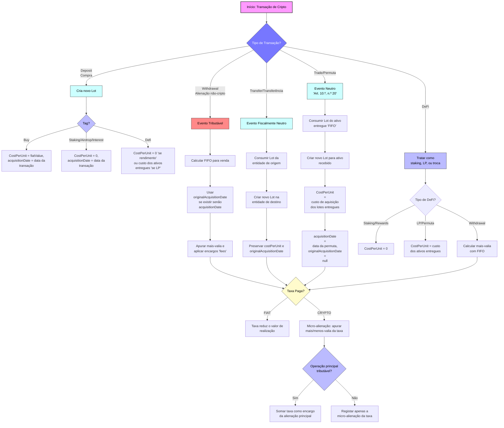

# Documento Técnico: Um algoritmo aberto para a fiscalidade de criptoativos em Portugal

### Índice

1. [Objetivo do projeto](#1-objetivo-do-projeto)  
2. [Arquitetura do algoritmo (v1.1)](#2-arquitetura-do-algoritmo-v11)  
   1. [Visão geral e conformidade legal](#1-visão-geral-e-conformidade-legal)  
   2. [Estrutura de dados e lotes](#2-estrutura-de-dados-lotes-e-o-campo-originalacquisitiondate)  
   3. [Tratamento por tipo de transação](#3-tratamento-por-tipo-de-transação)  
      1. [Depósito (`deposit`)](#31-deposit)  
      2. [Levantamento (`withdrawal`)](#32-withdrawal)  
      3. [Permuta (`trade`)](#33-trade-permuta-cripto-cripto)  
   4. [Tratamento das taxas](#4-tratamento-das-taxas)  
      1. [Taxa paga em FIAT](#41-taxa-paga-em-fiat)  
      2. [Taxa paga em cripto](#42-taxa-paga-em-cripto)  
   5. [Tratamento fiscal de NFT](#5-tratamento-fiscal-de-nft)
      1. [O que é NFT](#51-o-que-é-nft)
      2. [Enquadramento fiscal de NFT em Portugal (CIRS)](#52-enquadramento-fiscal-de-nft-em-portugal-cirs)
   6. [Tratamento fiscal de DeFi](#6-tratamento-fiscal-de-defi)
      1. [O que é DeFi](#61-o-que-é-defi)
      2. [Enquadramento fiscal em Portugal (CIRS)](#62-enquadramento-fiscal-de-defi-em-portugal-cirs)
      3. [Princípios aplicáveis ao DeFi](#63-princípios-aplicáveis-ao-defi)
      4. [Como implementar DeFi no algoritmo](#64-como-implementar-defi-no-algoritmo)
   7. [Sumário Final](#7-sumário-final)  
   8. [Fluxograma das transações](#8-fluxograma-das-transações)  
3. [Como contribuir](#🤝-como-contribuir)  
4. [Licença](#📄-licença)

## 1. Objetivo do projeto

Este repositório contém uma especificação técnica aberta e um algoritmo para o cálculo fiscal de mais-valias de criptoativos em Portugal, de acordo com o Código do IRS.

O objetivo é criar e manter uma "fonte da verdade" lógica e transparente que possa ser:
*   **Validada** por especialistas em fiscalidade e contabilidade.
*   **Discutida e melhorada** pela comunidade.
*   **Implementada** por qualquer desenvolvedor ou aplicação que precise de calcular mais-valias de criptoativos em Portugal.

**Este é um projeto de lógica e especificação, não de código.** A sua contribuição, seja através de uma `issue` para apontar uma falha na interpretação da lei ou de um `pull request` para melhorar este documento, é extremamente bem-vinda.

---

## 2. Arquitetura do algoritmo (v1.2)

### 1. Visão geral e conformidade legal

Este documento descreve um algoritmo fiscal, desenhado para estar em conformidade com o Código do IRS português, nomeadamente os Artigos **10.º** e **43.º**. A abordagem segue uma interpretação **conservadora, rigorosa e lógica** da lei.

O motor opera sobre cinco princípios fundamentais:

1. **FIFO por entidade depositária (Art. 43.º, n.º 9):**  
   O método `FIFO (First-In, First-Out) é aplicado individualmente a cada "entidade depositária" (ex.: exchanges).  
   Todas as carteiras **self-custody** (frias, quentes, etc.) são tratadas como uma única entidade depositária para efeitos de cálculo, a menos que o utilizador opte por separá-las.

2. **Transferência entre entidades é um evento neutro:**  
   Transferir ativos entre entidades do mesmo titular é uma mera mudança de local de custódia. **Não é um evento tributável**.  
   O lote transferido mantém **custo e data de aquisição originais**.

3. **Neutralidade fiscal para permutas cripto-cripto (Art. 10.º, n.º 20):**  
   Numa permuta cripto-cripto (ex.: BTC → ETH), a operação é uma alienação onerosa mas **não gera tributação** no momento da troca.  
   O novo ativo é considerado uma **nova aquisição**, com **valor de aquisição igual ao valor de aquisição do ativo entregue,** e nova data da permuta. Este valor e nova data servirá como base para o cálculo de futuras mais-valias, caso o novo ativo seja posteriormente vendido para FIAT.

4. **Rendimentos em cripto como custo zero:** Rendimentos passivos (Staking, Airdrops, Juros, Recompensas, etc.) recebidos em cripto são tratados como **aquisições com `cost basis` igual a zero**.

---

### 2. Estrutura de dados: Lotes e o campo `originalAcquisitionDate`

O sistema utiliza uma estrutura de pilhas FIFO por entidade: um `Map<Entity, Map<Asset, List<Lot>>>`.

Cada `Lot` deve ter:

*   **`acquisitionDate`**
*   **`costPerUnit`**
*   **`amount`**
*   **`originalAcquisitionDate` (opcional)**

>**📝 Nota:** Para que serve `originalAcquisitionDate`?   
>
>Para preservar a data real de aquisição de um lote que foi comprado numa entidade **A** e posteriormente transferido para **B**.  
>Sem este campo, o algoritmo poderia reiniciar o contador dos **365 dias** ao receber o ativo noutra entidade

---

### 3. Tratamento por tipo de transação

#### 3.1. `deposit`

Um depósito é sempre uma **aquisição** que cria um novo lote:

*   **tag: '`buy`':** `costPerUnit` = `fiatValue`, `acquisitionDate` = data da transação.
*   **tag: '`staking`', '`airdrop`', '`interest`', '`rewards`':** `costPerUnit` = 0, `acquisitionDate` = data da transação.
*   **`originalAcquisitionDate`** = `null`.

#### ➤ Caso 1: Compra com FIAT (`tag: 'buy'`)
**Exemplo:**
- Data: 2023-01-15
- Entidade: Binance
- Ativo: BTC
- Quantidade: 1.0
- Valor em FIAT: 30.000€

**Resultado:**
- Cria novo lote:
  - `acquisitionDate = 2023-01-15`
  - `costPerUnit = 30.000€`
  - `amount = 1.0`
  - `originalAcquisitionDate = null`

#### ➤ Caso 2: Rendimento passivo (`tag: 'staking'`)
**Exemplo:**
- Data: 2024-03-10
- Entidade: Ledger
- Ativo: ETH
- Quantidade: 2.0
- Valor em FIAT: 0€ (rendimento passivo)

**Resultado:**
- Cria novo lote:
  - `acquisitionDate = 2024-03-10`
  - `costPerUnit = 0€`
  - `amount = 2.0`
  - `originalAcquisitionDate = null`

---

#### 3.2. `withdrawal`

Inclui **qualquer alienação para algo não-cripto**, como:

*   **FIAT**  
*   **NFT**
*   **Compra de bens ou serviços**
*   **Pagamentos com cartões que gaste a sua cripto**

#### Caso seja **alienação para algo não-cripto** (`fiatValue > 0`):

➡️ **Evento tributável.**

Aciona `_calculateFifoForSale` na entidade de origem.

Para cada lote consumido: `**data de aquisição efetiva = originalAcquisitionDate ?? acquisitionDate**

Isto garante que transferências anteriores não reiniciam o contador dos 365 dias.

#### Caso seja **transferência** (`tag = 'transfer'` e `fiatValue` = `null`):

➡️ **Evento neutro.**

 1. Consome lotes da entidade de origem.  
 2. Cria lotes na entidade de destino.  
 3. Mantém:
    * `costPerUnit`
    * `originalAcquisitionDate` correto.

A data da transferência `acquisitionDate` **não influencia os 365 dias**.

### ➤ Caso 1: Venda para FIAT (`fiatValue > 0`, `tag: 'sell'`)
**Exemplo:**
- Data: 2024-10-01
- Entidade: Binance
- Ativo: BTC
- Quantidade: 0.5
- Valor em FIAT: 30.000€
- Custo do lote consumido (FIFO): 0.5 × 30.000€ = 15.000€
- Data de aquisição efetiva: 2023-01-15
- Dias detidos: 624 dias → **isento de IRS**

**Cálculo:**
- Mais-valia = 30.000€ - 15.000€ = **15.000€**
- Tributação: **Isento** (≥365 dias)

#### ➤ Caso 2: Venda para FIAT com taxa em cripto
**Exemplo:**
- Data: 2024-10-01
- Entidade: Binance
- Ativo: BTC
- Quantidade: 0.5
- Valor em FIAT: 30.000€
- Taxa: 0.001 BTC (valor implícito: 60€)
- Custo do lote consumido: 15.000€
- Dias detidos: 180 dias → **tributável**

**Cálculo:**
- Mais-valia principal = 30.000€ - 15.000€ = **15.000€**
- Micro-alienação da taxa:
  - Custo da taxa = 0.001 × 30.000€ = 30€
  - Mais-valia da taxa = 60€ - 30€ = **30€**
- Total mais-valia = 15.000€ + 30€ = **15.030€**
- IRS devido = 15.030€ × 28% = **4.208,40€**

#### ➤ Caso 3: Transferência entre entidades (`tag: 'transfer'`, `fiatValue = null`)
**Exemplo:**
- Data: 2024-06-01
- Entidade de origem: Binance
- Entidade de destino: Ledger
- Ativo: BTC
- Quantidade: 0.5
- Custo do lote consumido: 0.5 × 30.000€ = 15.000€
- Data de aquisição original: 2023-01-15

**Resultado:**
- Cria novo lote na Ledger:
  - `acquisitionDate = 2024-06-01`
  - `costPerUnit = 30.000€`
  - `amount = 0.5`
  - `originalAcquisitionDate = 2023-01-15`

➡️ **Evento neutro fiscalmente**, não gera mais-valia.

#### 3.3. `trade` (Permuta cripto-cripto)

➡️ **Evento neutro - Art. 10.º, n.º 20**

 1. Consome lotes do ativo entregue.  
 2. Cria novo lote do ativo recebido.  
 3. O custo do novo lote é: `costPerUnit` = custo de aquisição dos lotes entregues
 4. `acquisitionDate` = data da permuta.  
 5. `originalAcquisitionDate` = `null`.

#### ➤ Caso 1: Permuta simples (BTC → ETH)
**Exemplo:**
- Data: 2024-07-01
- Entidade: Binance
- Ativo entregue: BTC (0.5)
- Ativo recebido: ETH (0.3)
- Custo do BTC entregue: 0.5 × 30.000€ = 15.000€

**Resultado:**
- Cria novo lote de ETH:
  - `acquisitionDate = 2024-07-01`
  - `costPerUnit = 15.000€ / 0.3 = 50.000€/ETH`
  - `amount = 0.3`
  - `originalAcquisitionDate = null`

➡️ **Evento neutro fiscalmente**, não gera tributação imediata.

---

#### ➤ Caso 2: Permuta com múltiplos ativos (BTC → ETH + SOL)
**Exemplo:**
- Data: 2024-08-15
- Entidade: Binance
- Ativo entregue: BTC (1.0)
- Ativos recebidos: ETH (0.3) + SOL (0.2)
- Valor de mercado implícito no momento da permuta:
  - ETH: 100€/unidade → 0.3 × 100€ = 30€
  - SOL: 50€/unidade → 0.2 × 50€ = 10€
  - Total: 40€

**Cálculo do custo proporcional:**
- Custo total do BTC entregue: 30.000€
- Custo do ETH = (30/40) × 30.000€ = **22.500€**
- Custo do SOL = (10/40) × 30.000€ = **7.500€**

**Resultado:**
- Lote de ETH:
  - `acquisitionDate = 2024-08-15`
  - `costPerUnit = 22.500€ / 0.3 = 75.000€/ETH`
  - `amount = 0.3`
  - `originalAcquisitionDate = null`
- Lote de SOL:
  - `acquisitionDate = 2024-08-15`
  - `costPerUnit = 7.500€ / 0.2 = 37.500€/SOL`
  - `amount = 0.2`
  - `originalAcquisitionDate = null`

➡️ **Evento neutro fiscalmente**, não gera tributação imediata.

---

### 4. Tratamento das taxas

A lógica de tratamento de taxas é 100% offline e determinística. A nossa interpretação, embora não explicitamente detalhada no CIRS para criptoativos, baseia-se na aplicação consistente dos princípios gerais de "alienação onerosa" (Art. 10.º) e "apuramento de mais-valias" (Art. 43.º), sendo a abordagem mais segura e convencional.

#### 4.1. Taxa paga em FIAT

➡️ **É apenas um encargo da alienação**, subtraído no cálculo da mais-valia.  

#### 4.2. Taxa paga em cripto

A taxa é uma **micro-alienação** do ativo usado para pagá-la.

Valor de realização:

1. **Venda para FIAT:**  
   Usa o **preço implícito** da venda: `**valor = fiatValue / fromAmount**

2. **Permuta ou transferência:**  
   Usa `feeFiatValue`, introduzido pelo utilizador.

#### Dupla entrada fiscal aplicável apenas quando deve ser:

- **Venda FIAT:**  
  - apura mais/menos-valia da taxa  
  - adiciona o valor às despesas dedutíveis da alienação principal

- **Permuta ou transferência:**  
  - só apura a micro-alienação da taxa  
  - **não** soma nada à operação principal (porque é neutra)

#### ➤ Caso 1: Taxa paga em FIAT
**Exemplo:**
- Venda de 0.5 BTC por 30.000€
- Taxa em FIAT: 50€

**Resultado:**
- Mais-valia = 30.000€ - 15.000€ - 50€ = **14.950€**
- Se tributável (<365 dias): IRS = 14.950€ × 28% = **4.186€**

---

#### ➤ Caso 2: Taxa paga em cripto
**Exemplo:**
- Venda de 0.5 BTC por 30.000€
- Taxa: 0.001 BTC (valor implícito: 60€)
- Custo da taxa: 0.001 × 30.000€ = 30€
- Mais-valia da taxa: 60€ - 30€ = **30€**

**Resultado:**
- Mais-valia principal = 30.000€ - 15.000€ = 15.000€
- Total mais-valia = 15.000€ + 30€ = **15.030€**
- IRS = 15.030€ × 28% = **4.208,40€**

---

### 5. Tratamento fiscal de NFT
#### 5.1 O que é NFT? 
NFT significa Non-Fungible Token, em português: Token Não Fungível.

**Não fungível** = Único e irrepetível
Diferente de moedas ou criptomoedas (como Bitcoin ou Ethereum), que são fungíveis (ou seja, uma unidade é igual a outra).
Um NFT é único - não pode ser trocado por outro igual, porque cada um tem características únicas.

Exemplo:
- Um Bitcoin = outro Bitcoin → fungível.
-Um NFT de uma obra de arte digital = só existe um → não fungível.

#### 5.2. Enquadramento fiscal de NFT em Portugal (CIRS)
Para efeitos do Código do IRS, NFT são tratados como criptoativos.

**As regras são exatamente as mesmas:**
* Compra de NFT com FIAT → aquisição normal.
* Compra de NFT com cripto → permuta neutra (Art. 10.º, n.º 20).
* Venda de NFT por FIAT, cripto, outro NFT ou serviços → alienação tributável se <365 dias.
* Permuta NFT-NFT → neutra; novo NFT recebe novo custo = custo do ativo entregue e nova data.
* Airdrops/recebimentos gratuitos de NFT → custo zero.

#### ➤ Caso 1: Compra de NFT com FIAT
**Exemplo:**
- Data: 2024-05-01
- Entidade: OpenSea
- Ativo: NFT-123
- Quantidade: 1
- Valor em FIAT: 500€

**Resultado:**
- Cria novo lote:
  - `acquisitionDate = 2024-05-01`
  - `costPerUnit = 500€`
  - `amount = 1`
  - `originalAcquisitionDate = null`

---

#### ➤ Caso 2: Venda de NFT por FIAT
**Exemplo:**
- Data: 2025-01-10
- Entidade: OpenSea
- Ativo: NFT-123
- Quantidade: 1
- Valor em FIAT: 800€
- Custo: 500€
- Dias detidos: 254 dias → **tributável**

**Cálculo:**
- Mais-valia = 800€ - 500€ = **300€**
- IRS = 300€ × 28% = **84€**

---

#### ➤ Caso 3: Permuta NFT-NFT
**Exemplo:**
- Data: 2024-09-01
- Entidade: OpenSea
- Ativo entregue: NFT-123 (custo: 500€)
- Ativo recebido: NFT-456

**Resultado:**
- Cria novo lote de NFT-456:
  - `acquisitionDate = 2024-09-01`
  - `costPerUnit = 500€`
  - `amount = 1`
  - `originalAcquisitionDate = null`

➡️ **Evento neutro fiscalmente**, não gera tributação imediata.

---

### 6. Tratamento fiscal de DeFi
#### 6.1. O que é DeFi?

**DeFi (Decentralized Finance)** = Finanças Descentralizadas.

São **aplicações financeiras construídas em blockchains** (normalmente Ethereum, Solana, Polygon, etc.) que **não dependem de intermediários tradicionais** (bancos, corretoras, etc.).

#### Exemplos comuns de DeFi:
- **Staking** (delegar tokens para validar redes)
- **Lending & Borrowing** (emprestar ou pedir emprestado cripto)
- **Liquidity Pools** (fornecer liquidez em exchanges descentralizadas como Uniswap)
- **Yield Farming** (ganhar recompensas por fornecer liquidez)
- **Stablecoins** (USDC, DAI, etc.)
- **Derivados e seguros descentralizados**

#### 6.2. Enquadramento fiscal de DeFi em Portugal (CIRS)

O **Código do IRS não distingue explicitamente entre DeFi e CeFi**, ou seja, **o tratamento fiscal é o mesmo** para todos os ativos móveis, incluindo os gerados em DeFi.

#### 6.3 Princípios aplicáveis ao DeFi:

1. **Rendimentos passivos (staking, yield farming, recompensas)** → **custo zero** (Art. 10.º, n.º 1 e 20).
2. **Alienação de ativos DeFi (venda, troca, saque)** → **mais-valia calculada com FIFO** (Art. 43.º, n.º 9).
3. **Permutas DeFi (ex.: ETH → LP Token)** → **neutras fiscalmente** (Art. 10.º, n.º 20).
4. **Taxas em DeFi (gas fees, comissões)** → tratadas como **micro-alienações** se pagas em cripto.
5. **Isenção após 365 dias** → aplicável, desde que o ativo seja detido pore 365 diasou mais (independentemente de estar em DeFi ou CeFi).

#### 6.4. Como implementar DeFi no algoritmo

#### ➤ Caso 1: Staking / Yield Farming / Recompensas

**Exemplo:**
- Data: 2024-06-15
- Entidade: Uniswap (DeFi)
- Ativo: USDC
- Quantidade: 100
- Tipo: `deposit`
- Tag: `defi` (ou `staking`)

**Resultado:**
- Cria novo lote:
  - `acquisitionDate = 2024-06-15`
  - `costPerUnit = 0€` (rendimento passivo)
  - `amount = 100`
  - `originalAcquisitionDate = null`

➡️ **Evento não tributável no momento**, mas se vender mais tarde, apura-se mais-valia com base no custo zero.

---

#### ➤ Caso 2: Fornecimento de liquidez (Liquidity Pool)

**Exemplo:**
- Data: 2024-07-01
- Entidade: Uniswap
- Ativo entregue: ETH (0.5) + USDC (500)
- Ativo recebido: UNI-V2 LP Token (1.0)
- Custo total dos ativos entregues: 0.5 × 3.000€ + 500€ = 2.000€

**Resultado:**
- Cria novo lote de LP Token:
  - `acquisitionDate = 2024-07-01`
  - `costPerUnit = 2.000€ / 1.0 = 2.000€/LP`
  - `amount = 1.0`
  - `originalAcquisitionDate = null`

➡️ **Evento neutro fiscalmente**, permuta cripto-cripto (Art. 10.º, n.º 20).

---

#### ➤ Caso 3: Retirada de liquidez (Withdrawal de LP)

**Exemplo:**
- Data: 2025-01-10
- Entidade: Uniswap
- Ativo: UNI-V2 LP Token (1.0)
- Quantidade: 1.0
- Valor em FIAT: 2.500€ (valor de mercado implícito)
- Custo do LP Token: 2.000€
- Dias detidos: 193 dias → **tributável**

**Cálculo:**
- Mais-valia = 2.500€ - 2.000€ = **500€**
- IRS = 500€ × 28% = **140€**

---

#### ➤ Caso 4: Taxas em DeFi (gas fees)

**Exemplo:**
- Transação DeFi (ex.: staking)
- Taxa paga em ETH: 0.005 ETH
- Valor implícito da taxa: 0.005 × 3.000€ = 15€
- Custo da taxa: 0.005 × 3.000€ = 15€ (se o ETH foi comprado por 3.000€)

**Resultado:**
- Micro-alienação da taxa: 15€ - 15€ = **0€**
- Se a operação principal for tributável, a taxa é **dedutível como encargo**.

---

### 7. Sumário final

- **Depósitos:** criam novos lotes com custo real ou zero, dependendo do tipo (`buy` ou rendimento passivo).  
- **Alienações para FIAT, NFT, bens, serviços ou qualquer ativo não-cripto:** tributáveis se detidos menos de 365 dias; isentos se ≥=365 dias. Apuram-se mais-valias usando FIFO e preservando datas originais.
- **Transferências entre entidades:** evento neutro, preserva data e custo.  
- **Permutas:** evento neutro - o novo ativo tem como custo o valor de aquisição do ativo entregue e como data de aquisição a data da permuta
- **Taxas:** separa lógica entre FIAT e cripto, aplicando dupla entrada quando necessário - e podem tambem ser dedutiveis nas mais-valias

---

### 8. Fluxograma das transações

[Ver fluxograma](diagrams/fluxograma.mermaid.svg)

---

## 🤝 Como Contribuir

Encontrou uma falha na nossa lógica? Acha que uma interpretação pode ser mais rigorosa?
1.  Abra uma **[Issue](issues)** para iniciar a discussão.
2.  Se tiver uma sugestão de texto, pode submeter um **Pull Request** para melhorar este documento.

---

## 📄 Licença

Este projeto é licenciado sob a [MIT License](LICENSE).  
Consulta o ficheiro para mais detalhes.