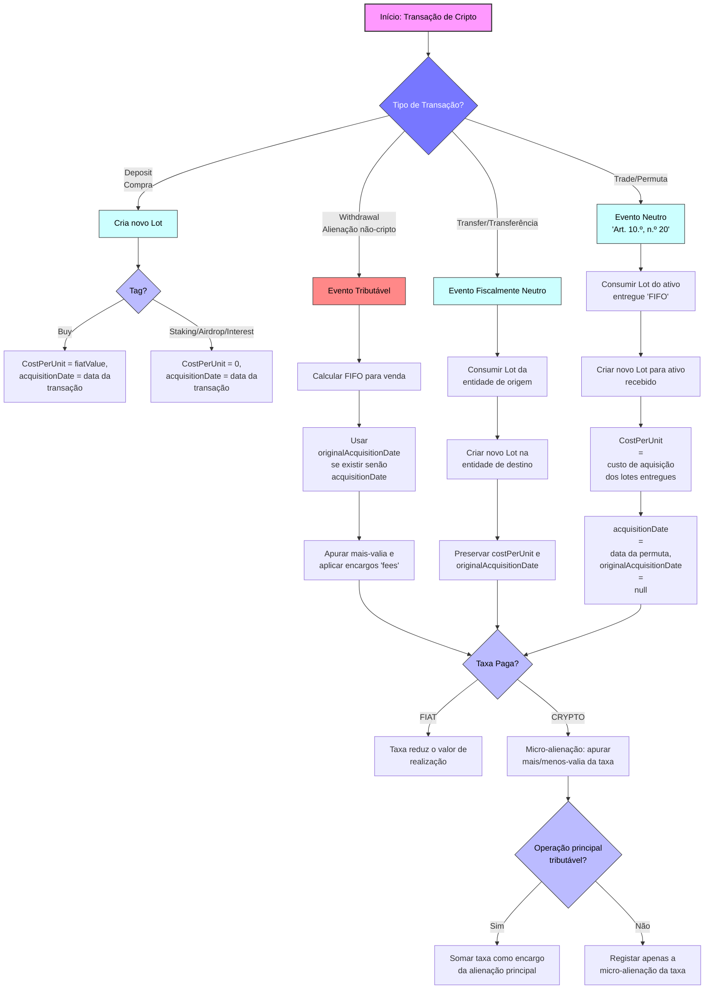

# Documento Técnico: Um Algoritmo Aberto para a Fiscalidade de Criptoativos em Portugal

## Objetivo do Projeto

Este repositório contém uma especificação técnica aberta e um algoritmo para o cálculo fiscal de mais-valias de criptoativos em Portugal, de acordo com o Código do IRS.

O objetivo é criar e manter uma "fonte da verdade" lógica e transparente que possa ser:
*   **Validada** por especialistas em fiscalidade e contabilidade.
*   **Discutida e melhorada** pela comunidade.
*   **Implementada** por qualquer desenvolvedor ou aplicação que precise de calcular mais-valias de criptoativos em Portugal.

**Este é um projeto de lógica e especificação, não de código.** A sua contribuição, seja através de uma `issue` para apontar uma falha na interpretação da lei ou de um `pull request` para melhorar este documento, é extremamente bem-vinda.

---

## Arquitetura do Algoritmo (v1.1)

### 1. Visão Geral e Conformidade Legal

Este documento descreve um algoritmo fiscal, desenhado para estar em conformidade com o Código do IRS português, nomeadamente os Artigos **10.º** e **43.º**. A abordagem segue uma interpretação **conservadora, rigorosa e lógica** da lei.

O motor opera sobre cinco princípios fundamentais:

1. **FIFO por entidade depositária (Art. 43.º, n.º 9):**  
   O método `FIFO (First-In, First-Out) é aplicado individualmente a cada “entidade depositária” (ex.: exchanges).  
   Todas as carteiras *self-custody* (frias, quentes, etc.) são agregadas e tratadas como uma única entidade para efeitos de cálculo.

2. **Transferência entre entidades é um evento neutro:**  
   Transferir ativos entre entidades do mesmo titular é uma mera mudança de local de custódia. **Não é um evento tributável**.  
   O lote transferido mantém **custo e data de aquisição originais**.

3. **Neutralidade fiscal para permutas cripto-cripto (Art. 10.º, n.º 20):**  
   Numa permuta cripto-cripto (ex.: BTC → ETH), a operação é uma alienação onerosa mas **não gera tributação** no momento da troca.  
   O novo ativo é considerado uma **nova aquisição**, com **valor de aquisição igual ao valor de aquisição do ativo entregue,** e nova data da permuta. Este valor e nova data servirá como base para o cálculo de futuras mais-valias, caso o novo ativo seja posteriormente vendido para FIAT.

4. **Rendimentos em Cripto como Custo Zero:** Rendimentos passivos (Staking, Airdrops, Juros, Recompensas, etc.) recebidos em cripto são tratados como **aquisições com `cost basis` igual a zero**.

5. **Abordagem 100% Offline (Guiada pelo Utilizador):** O motor não depende de APIs externas. O utilizador é a única fonte da verdade para todos os valores de mercado necessários.

---

### 2. Estrutura de dados: Lotes e o campo `originalAcquisitionDate`

O sistema utiliza uma estrutura de pilhas FIFO por entidade: um `Map<Entity, Map<Asset, List<Lot>>>`.

Cada `Lot` deve ter:

*   **`acquisitionDate`**
*   **`costPerUnit`**
*   **`amount`**
*   **`originalAcquisitionDate` (opcional)**

### Para que serve `originalAcquisitionDate`?

Para preservar a data real de aquisição de um lote que foi comprado numa entidade **A** e posteriormente transferido para **B**.  
Sem este campo, o algoritmo poderia reiniciar o contador dos **365 dias** ao receber o ativo noutra entidade — o que seria incorreto.

---

### 3. Tratamento por tipo de transação

#### 3.1. `deposit`

Um depósito é sempre uma **aquisição** que cria um novo lote:

*   **tag: '`buy`':** `costPerUnit` = `fiatValue`, `acquisitionDate` = data da transação.
*   **tag: '`staking`', '`airdrop`', '`interest`', '`rewards`':** `costPerUnit` = 0, `acquisitionDate` = data da transação.
*   **`originalAcquisitionDate`** = `null`.

---

#### 3.2. `withdrawal`

Inclui **qualquer alienação para algo não-cripto**, como:

*   **FIAT**  
*   **NFT**
*   **Compra de bens ou serviços**
*   **Pagamentos com cartões que gaste a sua cripto**

#### Caso seja **alienação para algo não-cripto** (`fiatValue > 0`):

➡️ Evento tributável.

Aciona `_calculateFifoForSale` na entidade de origem.

Para cada lote consumido: `**data de aquisição efetiva = originalAcquisitionDate ?? acquisitionDate**

Isto garante que transferências anteriores não reiniciam o contador dos 365 dias.

#### Caso seja **transferência** (`tag = 'transfer'` e `fiatValue` = `null`):

➡️ Evento neutro.

 1. Consome lotes da entidade de origem.  
 2. Cria lotes na entidade de destino.  
 3. Mantém:
    * `costPerUnit`
    * `originalAcquisitionDate` correto.

A data da transferência `acquisitionDate` **não influencia os 365 dias**.

---

#### 3.3. `trade` (Permuta cripto-cripto)

➡️ **Evento neutro — Art. 10.º, n.º 20**

 1. Consome lotes do ativo entregue.  
 2. Cria novo lote do ativo recebido.  
 3. O custo do novo lote é: `costPerUnit` = custo de aquisição dos lotes entregues
 4. `acquisitionDate` = data da permuta.  
 5. `originalAcquisitionDate` = `null`.

---

### 4. Tratamento das taxas

A lógica de tratamento de taxas é 100% offline e determinística. A nossa interpretação, embora não explicitamente detalhada no CIRS para criptoativos, baseia-se na aplicação consistente dos princípios gerais de "alienação onerosa" (Art. 10.º) e "apuramento de mais-valias" (Art. 43.º), sendo a abordagem mais segura e convencional.

#### 4.1. Taxa paga em FIAT

➡️ **É apenas um encargo da alienação**, subtraído no cálculo da mais-valia.  

#### 4.2. Taxa paga em cripto

A taxa é uma **micro-alienação** do ativo usado para pagá-la.

Valor de realização:

1. **Venda para FIAT:**  
   Usa o **preço implícito** da venda: `**valor = fiatValue / fromAmount**

2. **Permuta ou Transferência:**  
   Usa `feeFiatValue`, introduzido pelo utilizador.

#### Dupla entrada fiscal aplicável apenas quando deve ser:

- **Venda FIAT:**  
  - apura mais/menos-valia da taxa  
  - adiciona o valor às despesas dedutíveis da alienação principal

- **Permuta ou Transferência:**  
  - só apura a micro-alienação da taxa  
  - **não** soma nada à operação principal (porque é neutra)

---

### 5. Tratamento Fiscal de NFT

Para efeitos do Código do IRS, NFT são tratados como criptoativos.

**As regras são exatamente as mesmas:**
* Compra de NFT com FIAT → aquisição normal.
* Compra de NFT com cripto → permuta neutra (Art. 10.º, n.º 20).
* Venda de NFT por FIAT, cripto, outro NFT ou serviços → alienação tributável se <365 dias.
* Permuta NFT-NFT → neutra; novo NFT recebe novo custo = custo do ativo entregue e nova data.
* Airdrops/recebimentos gratuitos de NFT → custo zero.

---

### 6. Tratamento fiscal de DeFi
TODO

---

#### 🔹 Sumário Final

- **Depósitos:** criam novos lotes com custo real ou zero, dependendo do tipo (`buy` ou rendimento passivo).  
- **Alienações para FIAT, NFT, bens, serviços ou qualquer ativo não-cripto:** tributáveis se detidos menos de 365 dias; isentos se ≥=365 dias. Apuram-se mais-valias usando FIFO e preservando datas originais.
- **Transferências entre entidades:** evento neutro, preserva data e custo.  
- **Permutas:** evento neutro, novo ativo tem como custo o valor original do ativo entregue e nova data na permuta 
- **Taxas:** separa lógica entre FIAT e cripto, aplicando dupla entrada quando necessário que podem tambem ser dedutiveis nas mais-valias

---

# Fluxograma das Transações

[Ver fluxograma](/diagrams/fluxograma.mermaid.svg)

---

## 🤝 Como Contribuir

Encontrou uma falha na nossa lógica? Acha que uma interpretação pode ser mais rigorosa?
1.  Abra uma **[Issue](issues)** para iniciar a discussão.
2.  Se tiver uma sugestão de texto, pode submeter um **Pull Request** para melhorar este documento.

---

## 📄 Licença

Este projeto é licenciado sob a [MIT License](LICENSE).  
Consulta o ficheiro para mais detalhes.
