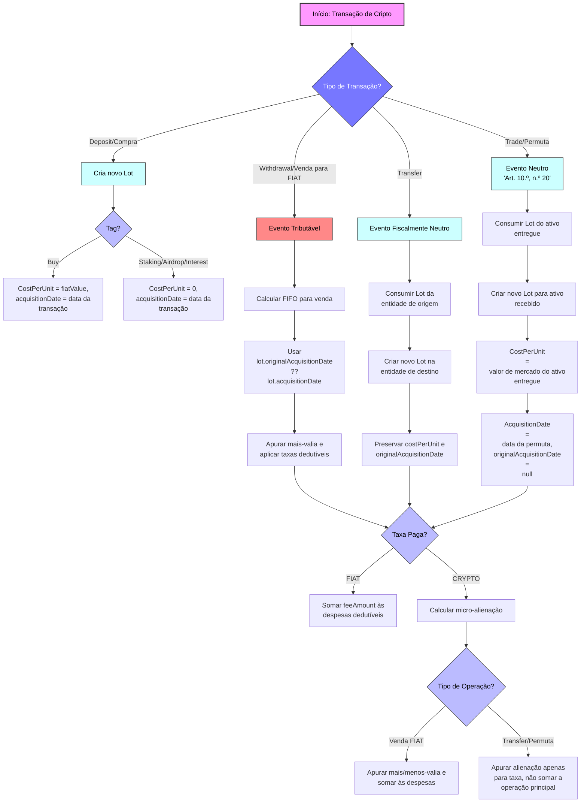

# Documento Técnico: Um Algoritmo para Cálculo Fiscal de Criptoativos em Portugal (v1.0)

## 1. Visão Geral e Conformidade Legal

Este documento detalha um algoritmo fiscal, desenhado para estar em conformidade com o Código do IRS português, nomeadamente os Artigos 10.º e 43.º. A arquitetura baseia-se na interpretação lógica, conservadora e rigorosa da lei.

O motor opera sobre cinco princípios fundamentais:

1. **FIFO por Entidade Depositária (Art. 43.º, n.º 9):** O método `FIFO` (First-In, First-Out) é aplicado de forma independente para cada "entidade depositária" (ex: exchange). Carteiras de *self-custody* (frias, quentes, etc.) são agregadas e tratadas como uma única entidade para efeitos de cálculo.

2. **Transferência entre Entidades é um Evento Neutro:** Uma transferência de um criptoativo entre duas entidades do mesmo titular é uma mera mudança de local de custódia. **Não é um evento tributável**. O lote transferido **mantém a sua data e valor de aquisição originais**.

3. **Neutralidade Fiscal para Permutas (Art. 10.º, n.º 20):** Numa permuta cripto-cripto (ex: BTC por ETH), a operação é **um evento neutro para efeitos de IRS**. Tecnicamente é uma **alienação onerosa** do ativo entregue, mas **não gera tributação no momento da troca**. O novo ativo é considerado uma **nova aquisição**, com **valor de aquisição igual ao valor de mercado do ativo entregue na data da permuta**. Este valor servirá como base para o cálculo de futuras mais-valias, caso o novo ativo seja posteriormente vendido para FIAT.

4. **Rendimentos como Custo Zero:** Rendimentos passivos (Staking, Airdrops, Juros, etc.) recebidos em cripto são tratados como **aquisições com `cost basis` igual a zero**.

5. **Abordagem 100% Offline (Guiada pelo Utilizador):** O motor não depende de APIs externas. O utilizador é a única fonte da verdade para todos os valores de mercado necessários.

---

## 2. Estrutura de Dados: Lotes e o Campo `originalAcquisitionDate`

O coração do sistema é a estrutura de pilhas `FIFO`: um `Map<Entity, Map<Asset, List<Lot>>>`.

Para implementar a lógica de transferência, o modelo de dados da aplicação (seja `Transaction` ou um novo modelo `Lot`) **deve incluir um campo para preservar a data de aquisição original**:

* `originalAcquisitionDate: DateTime?`

Este campo será usado **exclusivamente** para rastrear a data de aquisição de lotes que foram transferidos entre entidades depositárias.

---

## 3. Tratamento por Tipo de Transação

### 3.1. `deposit`

Um depósito é sempre uma **aquisição** que cria um novo `Lot`.

- **`tag: 'buy'`:** Cria um novo `Lot` com um `costPerUnit` baseado no `fiatValue` e uma `acquisitionDate` igual à data da transação. O campo `originalAcquisitionDate` é `null`.

- **`tag: 'staking', 'airdrop', 'interest', etc.`:** Cria um novo `Lot` com um `costPerUnit` de **zero**. A `acquisitionDate` é a data da transação. O campo `originalAcquisitionDate` é `null`.

---

### 3.2. `withdrawal`

- **Se `fiatValue` > 0 (Venda para FIAT):**
  - **Lógica:** Evento tributável.
  - **Algoritmo:** Aciona a função `_calculateFifoForSale` na pilha `FIFO` específica da `fromWalletId`. O cálculo dos 365 dias para cada lote consumido usa a data `lot.originalAcquisitionDate ?? lot.acquisitionDate`.

> #### Nota Explicativa: Como a Data de Aquisição é Rastreada
> A expressão `lot.originalAcquisitionDate ?? lot.acquisitionDate` é a forma técnica de dizer: "Usa a data de aquisição original se ela tiver sido preservada numa transferência; senão, usa a data de aquisição normal da compra."  
> Isto garante que uma transferência de um ativo entre as suas próprias contas (ex: de uma exchange para uma carteira fria) nunca reinicia injustamente o relógio dos 365 dias para o cálculo da isenção de mais-valias.

- **Se `fiatValue` for nulo e `tag: 'transfer'` (Transferência para outra Entidade):**
  - **Lógica:** Evento fiscalmente neutro que move um lote entre pilhas `FIFO`.
  - **Algoritmo:**
    1. Consome o(s) `Lot`(s) necessário(s) da pilha `FIFO` da `fromWalletId`.
    2. Para cada lote consumido, cria um novo `Lot` na pilha `FIFO` da `toWalletId`.
    3. O novo `Lot` herda o `costPerUnit` do lote original.
    4. O campo `originalAcquisitionDate` do novo `Lot` é preenchido com a data de aquisição do lote original (`original_lot.originalAcquisitionDate ?? original_lot.acquisitionDate`). A `date` do novo lote (que representa a data da transferência) é informativa mas não usada para o cálculo dos 365 dias.

---

### 3.3. `trade` (Permuta Crypto-Crypto)

- **Lógica:** Regime de neutralidade fiscal (Art. 10.º, n.º 20).
- **Algoritmo:**
  1. Consome o(s) `Lot`(s) do ativo de origem (ex: BTC) da sua pilha `FIFO`.
  2. Cria um novo `Lot` para o ativo de destino (ex: ETH) na mesma pilha FIFO.
  3. O **valor de aquisição (`costPerUnit`) do novo lote é o valor de mercado do ativo entregue na data da permuta**, conforme Art. 10.º, n.º 19.  
     - Esta permuta é **neutralidade fiscal**, ou seja, **não gera mais-valia tributável** no momento da troca.  
     - O novo ativo é considerado uma **nova aquisição**. Futuras vendas serão tributadas a partir deste custo de aquisição.
  4. A `acquisitionDate` do novo lote é a data da transação de `trade`. O seu campo `originalAcquisitionDate` é `null`.

---

## 4. Tratamento de Taxas

A lógica de tratamento de taxas é 100% offline e determinística. A nossa interpretação, embora não explicitamente detalhada no CIRS para criptoativos, baseia-se na aplicação consistente dos princípios gerais de "alienação onerosa" (Art. 10.º) e "apuramento de mais-valias" (Art. 43.º), sendo a abordagem mais segura e convencional.

> #### Justificação Legal da Abordagem
> 1. **Taxa como Alienação:** O ato de pagar uma taxa com um criptoativo (ex: 0.01 ETH) é considerado uma "alienação onerosa", pois há uma transferência de propriedade do ativo em troca de um serviço.  
> 2. **Dupla Entrada Fiscal:** O Art. 43.º do CIRS define que a mais-valia é a diferença entre o "valor de realização" e o "valor de aquisição", e permite a dedução de "despesas e encargos". A nossa abordagem aplica estes dois conceitos.

- **Taxa paga em FIAT:** O `feeAmount` é somado diretamente às despesas dedutíveis do ano fiscal.

- **Taxa paga em CRIPTO:** É sempre tratada com uma **lógica de dupla entrada**.  
  O valor de realização da taxa é determinado de duas formas:
  1. **Numa Venda Crypto-para-FIAT:** O valor é calculado automaticamente a partir do **preço implícito** da venda (`fiatValue / fromAmount`).
  2. **Noutras Transações (Trade, Transferência):** O valor é obtido a partir de um campo `feeFiatValue`, que a UI **obriga** o utilizador a preencher.

> **Nota importante:**  
> O valor apurado é usado para uma **dupla entrada apenas quando aplicável**:  
> - **Venda para FIAT:** apura a mais/menos-valia da micro-alienação **e** é somado às despesas dedutíveis da operação principal.  
> - **Permuta ou Transferência:** a taxa gera apenas a **sua própria alienação individual**, **não** é somada a qualquer despesa de operação neutra.

---

# Fluxograma das Transações

---

### 🔹 Como funciona:

- **Depósitos:** criam novos lotes com custo real ou zero, dependendo do tipo (`buy` ou rendimento passivo).  
- **Vendas para FIAT:** apuram mais-valias usando FIFO e datas corretas.  
- **Transferências entre entidades:** evento neutro, preserva data e custo.  
- **Permutas:** evento neutro, novo ativo tem como custo o valor de mercado do ativo entregue.  
- **Taxas:** separa lógica entre FIAT e cripto, aplicando dupla entrada quando necessário.  

---

