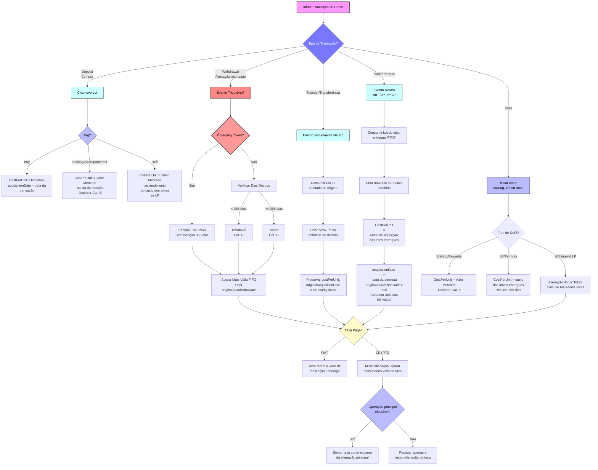

# Documento Técnico: Um algoritmo aberto para a fiscalidade de criptoativos em Portugal

---

### ⚠️ Aviso Legal e Limitações (Leitura Obrigatória)

Este algoritmo é uma ferramenta de cálculo baseada numa interpretação lógica do Código do IRS. No entanto, existem nuances legais críticas que exigem intervenção manual do utilizador:

1.  **Security Tokens (Valores Mobiliários):** O algoritmo assume por defeito que os ativos **NÃO** são valores mobiliários. Se o criptoativo representar uma participação financeira, dívida ou direito a dividendos (ex: tokens de equity, bonds tokenizados), a **isenção de 365 dias NÃO se aplica**. Estes ativos são sempre tributados (Categoria G), independentemente do tempo de detenção. O utilizador deve assinalar manualmente estes ativos como `isSecurityToken: true`.
2.  **Staking e Rendimentos Passivos (Categoria E):** A interpretação fiscal conservadora em 2026 exige que as recompensas de staking, lending e airdrops sejam declaradas como **Rendimentos de Capitais (Categoria E)** no momento da receção, taxadas a 28%. 
    *   *Comportamento do Algoritmo:* Para simplificar o rastreamento, o algoritmo regista estes eventos com `custo = valor de mercado na data da receção`. 
    *   *Ação do Utilizador:* Deve garantir que o valor desses rendimentos foi declarado no **Anexo E** do IRS do ano correspondente à receção. Na venda futura, o algoritmo calculará a mais-valia (Categoria G) apenas sobre a valorização posterior à receção, evitando a dupla tributação.
3.  **Anexos do IRS (G vs. J):** O cálculo da mais-valia é universal, mas o local de declaração depende da entidade:
    *   **Entidades Estrangeiras** (Binance, Coinbase, Ledger, Metamask, etc.): Preencher no **Anexo J**.
    *   **Entidades Nacionais** (Raro em cripto): Preencher no **Anexo G**.

---

### Índice

  - [Índice](#índice)
  - [1. Objetivo do projeto](#1-objetivo-do-projeto)
  - [2. Arquitetura do algoritmo (v1.4)](#2-arquitetura-do-algoritmo-v14)
    - [1. Visão geral e conformidade legal](#1-visão-geral-e-conformidade-legal)
    - [2. Estrutura de dados: Lotes e o campo `originalAcquisitionDate`](#2-estrutura-de-dados-lotes-e-o-campo-originalacquisitiondate)
    - [3. Tratamento por tipo de transação](#3-tratamento-por-tipo-de-transação)
      - [3.1. `deposit`](#31-deposit)
      - [➤ Caso 1: Compra com FIAT (`tag: 'buy'`)](#-caso-1-compra-com-fiat-tag-buy)
      - [➤ Caso 2: Rendimento passivo (`tag: 'staking'`)](#-caso-2-rendimento-passivo-tag-staking)
      - [3.2. `withdrawal`](#32-withdrawal)
      - [Caso seja **alienação para algo não-cripto** (`fiatValue > 0`):](#caso-seja-alienação-para-algo-não-cripto-fiatvalue--0)
      - [Caso seja **transferência** (`tag = 'transfer'` e `fiatValue` = `null`):](#caso-seja-transferência-tag--transfer-e-fiatvalue--null)
      - [➤ Caso 1: Venda para FIAT (`fiatValue > 0`, `tag: 'sell'`)](#-caso-1-venda-para-fiat-fiatvalue--0-tag-sell)
      - [➤ Caso 2: Venda para FIAT com taxa em cripto](#-caso-2-venda-para-fiat-com-taxa-em-cripto)
      - [➤ Caso 3: Transferência entre entidades com taxa (`tag: 'transfer'`, `fiatValue = null`)](#-caso-3-transferência-entre-entidades-com-taxa-tag-transfer-fiatvalue--null)
      - [3.3. `trade` (Permuta cripto-cripto)](#33-trade-permuta-cripto-cripto)
      - [➤ Caso 1: Permuta simples (BTC → ETH)](#-caso-1-permuta-simples-btc--eth)
      - [➤ Caso 2: Permuta com múltiplos ativos (BTC → ETH + SOL)](#-caso-2-permuta-com-múltiplos-ativos-btc--eth--sol)
    - [4. Tratamento das taxas](#4-tratamento-das-taxas)
      - [4.1. Taxa paga em FIAT](#41-taxa-paga-em-fiat)
      - [4.2. Taxa paga em cripto](#42-taxa-paga-em-cripto)
      - [Dupla entrada fiscal aplicável apenas quando deve ser:](#dupla-entrada-fiscal-aplicável-apenas-quando-deve-ser)
      - [➤ Caso 1: Taxa paga em FIAT](#-caso-1-taxa-paga-em-fiat)
      - [➤ Caso 2: Taxa paga em cripto](#-caso-2-taxa-paga-em-cripto)
    - [5. Tratamento fiscal de NFT](#5-tratamento-fiscal-de-nft)
      - [5.1 O que é NFT?](#51-o-que-é-nft)
      - [5.2. Enquadramento fiscal de NFT em Portugal (CIRS)](#52-enquadramento-fiscal-de-nft-em-portugal-cirs)
      - [➤ Caso 1: Compra de NFT com FIAT](#-caso-1-compra-de-nft-com-fiat)
      - [➤ Caso 2: Venda de NFT por FIAT](#-caso-2-venda-de-nft-por-fiat)
      - [➤ Caso 3: Permuta NFT-NFT](#-caso-3-permuta-nft-nft)
    - [6. Tratamento fiscal de DeFi](#6-tratamento-fiscal-de-defi)
      - [6.1. O que é DeFi?](#61-o-que-é-defi)
      - [Exemplos comuns de DeFi:](#exemplos-comuns-de-defi)
      - [6.2. Enquadramento fiscal de DeFi em Portugal (CIRS)](#62-enquadramento-fiscal-de-defi-em-portugal-cirs)
      - [6.3 Princípios aplicáveis ao DeFi:](#63-princípios-aplicáveis-ao-defi)
      - [6.4. Como implementar DeFi no algoritmo](#64-como-implementar-defi-no-algoritmo)
      - [➤ Caso 1: Staking / Yield Farming / Recompensas](#-caso-1-staking--yield-farming--recompensas)
      - [➤ Caso 2: Fornecimento de liquidez (Liquidity Pool)](#-caso-2-fornecimento-de-liquidez-liquidity-pool)
      - [➤ Caso 3: Retirada de liquidez (Withdrawal de LP)](#-caso-3-retirada-de-liquidez-withdrawal-de-lp)
      - [➤ Caso 4: Taxas em DeFi (gas fees)](#-caso-4-taxas-em-defi-gas-fees)
    - [7. Sumário final](#7-sumário-final)
    - [8. Fluxograma das transações](#8-fluxograma-das-transações)
  - [🤝 Como Contribuir](#-como-contribuir)
  - [📄 Licença](#-licença)

---

## 1. Objetivo do projeto

Este repositório contém uma especificação técnica aberta e um algoritmo para o cálculo fiscal de mais-valias de criptoativos em Portugal, de acordo com o Código do IRS.

O objetivo é criar e manter uma "fonte da verdade" lógica e transparente que possa ser:
*   **Validada** por especialistas em fiscalidade e contabilidade.
*   **Discutida e melhorada** pela comunidade.
*   **Implementada** por qualquer desenvolvedor ou aplicação que precise de calcular mais-valias de criptoativos em Portugal.

**Este é um projeto de lógica e especificação, não de código.** A sua contribuição, seja através de uma `issue` para apontar uma falha na interpretação da lei ou de um `pull request` para melhorar este documento, é extremamente bem-vinda.

---

## 2. Arquitetura do algoritmo (v1.4)

### 1. Visão geral e conformidade legal

Este documento descreve um algoritmo fiscal, desenhado para estar em conformidade com o Código do IRS português, nomeadamente os Artigos **10.º** e **43.º**. A abordagem segue uma interpretação **conservadora, rigorosa e lógica** da lei.

O motor opera sobre cinco princípios fundamentais:

1. **FIFO por entidade depositária (Art. 43.º, n.º 9):**  
   O método `FIFO (First-In, First-Out)` é aplicado individualmente a cada "entidade depositária" (ex.: exchanges).
   Todas as carteiras **self-custody** (frias, quentes, etc.) são tratadas como uma única entidade depositária para efeitos de cálculo, a menos que o utilizador opte por separá-las.

2. **Transferência entre entidades é um evento neutro:**  
   Transferir ativos entre entidades do mesmo titular é uma mera mudança de local de custódia. **Não é um evento tributável**.  
   O lote transferido mantém **custo e data de aquisição originais**.

3. **Neutralidade fiscal para permutas cripto-cripto (Art. 10.º, n.º 20):**  
   Numa permuta cripto-cripto (ex.: BTC → ETH), a operação é uma alienação onerosa mas **não gera tributação** no momento da troca.  
   O novo ativo é considerado uma **nova aquisição**, com **valor de aquisição igual ao valor de aquisição do ativo entregue**, e nova data da permuta. Este valor e nova data servirão como base para o cálculo de futuras mais-valias.
   *Nota:* A contagem dos 365 dias reinicia para o novo ativo recebido.

4. **Rendimentos em cripto (Staking/Airdrop):**  
   São tratados como **aquisições ao valor de mercado na data da receção**.
   *   **Fiscalidade:** Devem ser declarados como Rendimentos de Capitais (Categoria E) no ano da receção (taxa 28%).
   *   **Custo para Mais-Valias:** O `cost basis` é o valor de mercado no dia da receção (não zero), para evitar dupla tributação na venda futura.

5. **Distinção Security Tokens vs. Criptoativos Comuns:**
   *   **Criptoativos Comuns (Valores não mobiliários ex: BTC, ETH):** Isentos de imposto se detidos por >365 dias.
   *   **Security Tokens (Valores mobiliários):** **Nunca isentos**. Sempre tributados à taxa de 28% (ou englobamento), independentemente do tempo de detenção.

---

### 2. Estrutura de dados: Lotes e o campo `originalAcquisitionDate`

O sistema utiliza uma estrutura de pilhas FIFO por entidade: um `Map<Entity, Map<Asset, List<Lot>>>`.

Cada `Lot` deve ter:

*   **`acquisitionDate`**: Data da operação atual (ou da transferência).
*   **`costPerUnit`**: Custo unitário em EUR.
*   **`amount`**: Quantidade do ativo.
*   **`originalAcquisitionDate`** (opcional): Data da compra original (crucial para a regra dos 365 dias).
*   **`isSecurityToken`** (boolean): Define se o ativo está sujeito a tributação obrigatória (sem isenção de 365 dias).

>**📝 Nota:** Para que serve `originalAcquisitionDate`?   
>Para preservar a data real de aquisição de um lote que foi comprado numa entidade **A** e posteriormente transferido para **B**. Sem este campo, o algoritmo poderia reiniciar incorretamente o contador dos **365 dias** ao receber o ativo noutra entidade.

---

### 3. Tratamento por tipo de transação

#### 3.1. `deposit`

Um depósito é sempre uma **aquisição** que cria um novo lote:

*   **tag: '`buy`':** `costPerUnit` = `fiatValue`, `acquisitionDate` = data da transação.
*   **tag: '`staking`', '`airdrop`', '`interest`', '`rewards`':** 
    *   `costPerUnit` = **Valor de Mercado em EUR no dia da receção**.
    *   `acquisitionDate` = data da transação.
    *   *Nota Fiscal:* Este valor deve ser declarado no Anexo E (Categoria E) do IRS desse ano.
*   **`originalAcquisitionDate`** = `null`.

#### ➤ Caso 1: Compra com FIAT (`tag: 'buy'`)
**Exemplo:**
- Data: 2023-01-15
- Entidade: Binance
- Ativo: BTC
- Quantidade: 1.0
- Valor em FIAT: 30.000€

**Resultado:**
- Cria novo lote:
  - `acquisitionDate = 2023-01-15`
  - `costPerUnit = 30.000€`
  - `amount = 1.0`
  - `originalAcquisitionDate = null`
  - `isSecurityToken = false`

#### ➤ Caso 2: Rendimento passivo (`tag: 'staking'`)
**Exemplo:**
- Data: 2024-03-10
- Entidade: Ledger (ou Exchange)
- Ativo: ETH
- Quantidade: 0.05 (Recompensa típica mensal para um staking médio)
- Valor de mercado unitário na data: 3.000,00€

**Cálculo Interno do Algoritmo:**
- Valor Total a Declarar = 0.05 × 3.000,00€ = **150,00€**

**Resultado:**
- Cria novo lote:
  - `acquisitionDate = 2024-03-10`
  - `costPerUnit = 3.000,00€` (Valor de mercado unitário)
  - `amount = 0.05`
  - `originalAcquisitionDate = null`
- *Ação Fiscal:* Declarar **150,00€** como rendimento Categoria E no IRS de 2024.
  - *Nota:* Na venda futura deste lote, o custo a abater será estes 150,00€, evitando dupla tributação.

---

#### 3.2. `withdrawal`

Inclui **qualquer alienação para algo não-cripto**, como:
*   **FIAT**
*   **NFT**
*   **Compra de bens ou serviços**
*   **Pagamentos com cartões que gaste a sua cripto**

#### Caso seja **alienação para algo não-cripto** (`fiatValue > 0`):

➡️ **Evento tributável.**

Aciona `_calculateFifoForSale` na entidade de origem.

Para cada lote consumido: **`data de aquisição efetiva = originalAcquisitionDate ?? acquisitionDate`**

**Regra de Tributação:**
1.  Se `isSecurityToken == true`: **Sempre Tributável** (28% ou englobamento).
2.  Se `isSecurityToken == false`:
    *   Dias detidos < 365: **Tributável** (28% ou englobamento).
    *   Dias detidos >= 365: **Isento**.

#### Caso seja **transferência** (`tag = 'transfer'` e `fiatValue` = `null`):

➡️ **Evento neutro.**

 1. Consome lotes da entidade de origem.  
 2. Cria lotes na entidade de destino.  
 3. Preserva os seguintes dados inalterados:
    *   `costPerUnit`
    *   `originalAcquisitionDate`
    *   `isSecurityToken`

A data da transferência `acquisitionDate` **não influencia os 365 dias**.

#### ➤ Caso 1: Venda para FIAT (`fiatValue > 0`, `tag: 'sell'`)
**Exemplo:**
- Data: 2024-10-01
- Entidade: Binance (Estrangeira) → **Anexo J**
- Ativo: BTC
- Quantidade: 0.5
- Valor em FIAT: 30.000€
- Custo do lote consumido (FIFO): 0.5 × 30.000€ = 15.000€
- Data de aquisição efetiva: 2023-01-15
- Dias detidos: 624 dias → **Isento** (se não for Security Token)

**Cálculo:**
- Mais-valia = 30.000€ - 15.000€ = **15.000€**
- Tributação: **Isento** (≥365 dias e não-security token)

#### ➤ Caso 2: Venda para FIAT com taxa em cripto
**Exemplo:**
- Data: 2024-10-01
- Entidade: Binance
- Ativo: BTC
- Quantidade: 0.5
- Valor em FIAT: 30.000€
- Taxa: 0.001 BTC (valor implícito: 60€)
- Custo do lote consumido: 15.000€
- Dias detidos: 180 dias → **Tributável**

**Cálculo:**
- Mais-valia principal = 30.000€ - 15.000€ = **15.000€**
- Micro-alienação da taxa:
  - Custo da taxa = 0.001 × 30.000€ = 30€
  - Mais-valia da taxa = 60€ - 30€ = **30€**
- Total mais-valia = 15.000€ + 30€ = **15.030€**
- IRS devido = 15.030€ × 28% = **4.208,40€** (ou taxa progressiva se englobado)

#### ➤ Caso 3: Transferência entre entidades com taxa (`tag: 'transfer'`, `fiatValue = null`)
**Exemplo:**
- Data: 2024-06-01
- Entidade de origem: Binance
- Entidade de destino: Ledger
- Ativo: BTC
- Quantidade enviada: 0.5
- Taxa: 0.001 BTC (valor implícito: 60€)
- Custo do lote consumido: 0.5 × 30.000€ = 15.000€
- Data de aquisição original: 2023-01-15

**Resultado:**
- **Micro-alienação da taxa:**
  - Custo da taxa = 0.001 × 30.000€ = 30€
  - Mais-valia da taxa = 60€ - 30€ = **30€** (Tributável se o lote da taxa tiver <365 dias)
- **Cria novo lote na Ledger:**
  - `acquisitionDate = 2024-06-01`
  - `costPerUnit = 30.000€`
  - `amount = 0.499`
  - `originalAcquisitionDate = 2023-01-15`
  - `isSecurityToken` = (mantido do original)

➡️ **Evento neutro fiscalmente** para o principal, mas a taxa é uma micro-alienação tributável.

---

#### 3.3. `trade` (Permuta cripto-cripto)

➡️ **Evento neutro - Art. 10.º, n.º 20**

 1. Consome lotes do ativo entregue.
 2. Cria novo lote do ativo recebido.
 3. O custo do novo lote é: `costPerUnit` = custo de aquisição dos lotes entregues (proporcional).
 4. `acquisitionDate` = data da permuta.
 5. `originalAcquisitionDate` = `null` (O contador de 365 dias reinicia para o novo ativo).
 6. `isSecurityToken` = (definido conforme a natureza do novo ativo recebido).

#### ➤ Caso 1: Permuta simples (BTC → ETH)
**Exemplo:**
- Data: 2024-07-01
- Entidade: Binance
- Ativo entregue: BTC (0.5) - Custo total: 15.000€
- Ativo recebido: ETH (0.3)

**Resultado:**
- Cria novo lote de ETH:
  - `acquisitionDate = 2024-07-01`
  - `costPerUnit = 15.000€ / 0.3 = 50.000€/ETH`
  - `amount = 0.3`
  - `originalAcquisitionDate = null` (Contador reinicia)
  - `isSecurityToken = false` (Assumindo ETH comum)

➡️ **Evento neutro fiscalmente**, não gera tributação imediata.

---

#### ➤ Caso 2: Permuta com múltiplos ativos (BTC → ETH + SOL)
**Exemplo:**
- Data: 2024-08-15
- Entidade: Binance
- Ativo entregue: BTC (1.0) - Custo total: 30.000€
- Ativos recebidos: ETH (0.3) + SOL (0.2)
- Valor de mercado implícito no momento da permuta:
  - ETH: 100€/unidade → 0.3 × 100€ = 30€ (75% do valor total)
  - SOL: 50€/unidade → 0.2 × 50€ = 10€ (25% do valor total)
  - Total: 40€ (valores relativos para distribuição de custo)

**Cálculo do custo proporcional:**
- Custo total do BTC entregue: 30.000€
- Custo do ETH = 75% × 30.000€ = **22.500€**
- Custo do SOL = 25% × 30.000€ = **7.500€**

**Resultado:**
- Lote de ETH:
  - `acquisitionDate = 2024-08-15`
  - `costPerUnit = 22.500€ / 0.3 = 75.000€/ETH`
  - `amount = 0.3`
  - `originalAcquisitionDate = null`
- Lote de SOL:
  - `acquisitionDate = 2024-08-15`
  - `costPerUnit = 7.500€ / 0.2 = 37.500€/SOL`
  - `amount = 0.2`
  - `originalAcquisitionDate = null`

➡️ **Evento neutro fiscalmente**, não gera tributação imediata.

---

### 4. Tratamento das taxas

A lógica de tratamento de taxas é 100% offline e determinística. A nossa interpretação baseia-se na aplicação consistente dos princípios gerais de "alienação onerosa" (Art. 10.º) e "apuramento de mais-valias" (Art. 43.º).

#### 4.1. Taxa paga em FIAT

➡️ **É apenas um encargo da alienação**, subtraído no cálculo da mais-valia.  

#### 4.2. Taxa paga em cripto

A taxa é uma **micro-alienação** do ativo usado para pagá-la.

Valor de realização:

1. **Venda para FIAT:**  
   Usa o **preço implícito** da venda: **`valor = fiatValue / fromAmount`**

2. **Permuta ou transferência:**  
   Usa `feeFiatValue`, introduzido pelo utilizador.

#### Dupla entrada fiscal aplicável apenas quando deve ser:

- **Venda FIAT:**  
  - apura mais/menos-valia da taxa  
  - adiciona o valor às despesas dedutíveis da alienação principal (ou soma à mais-valia se considerada venda parcial)

- **Permuta ou transferência:**  
  - só apura a micro-alienação da taxa  
  - **não** soma nada à operação principal (porque é neutra)

#### ➤ Caso 1: Taxa paga em FIAT
**Exemplo:**
- Venda de 0.5 BTC por 30.000€
- Taxa em FIAT: 50€

**Resultado:**
- Mais-valia = 30.000€ - 15.000€ - 50€ = **14.950€**
- Se tributável (<365 dias): IRS = 14.950€ × 28% = **4.186€**

---

#### ➤ Caso 2: Taxa paga em cripto
**Exemplo:**
- Venda de 0.5 BTC por 30.000€
- Taxa: 0.001 BTC (valor implícito: 60€)
- Custo da taxa: 0.001 × 30.000€ = 30€
- Mais-valia da taxa: 60€ - 30€ = **30€**

**Resultado:**
- Mais-valia principal = 30.000€ - 15.000€ = 15.000€
- Total mais-valia = 15.000€ + 30€ = **15.030€**
- IRS = 15.030€ × 28% = **4.208,40€**

> **📝 Nota sobre taxas em transferências:**  
> Mesmo que a transferência entre entidades do mesmo titular seja neutra fiscalmente, a taxa de rede paga em cripto é uma micro-alienação — e deve ser apurada separadamente para manter a precisão dos custos nos lotes.

---

### 5. Tratamento fiscal de NFT
#### 5.1 O que é NFT?
NFT significa Non-Fungible Token, em português: Token Não Fungível.

**Não fungível** = Único e irrepetível.
Diferente de moedas ou criptomoedas (como Bitcoin ou Ethereum), que são fungíveis.
Um NFT é único - não pode ser trocado por outro igual.

**Exemplo:**
- Um Bitcoin = outro Bitcoin → fungível.
- Um NFT de uma obra de arte digital = só existe um → não fungível.

#### 5.2. Enquadramento fiscal de NFT em Portugal (CIRS)
Para efeitos do Código do IRS, NFT são tratados como criptoativos.

**As regras são exatamente as mesmas:**
* Compra de NFT com FIAT → aquisição normal.
* Compra de NFT com cripto → permuta neutra (Art. 10.º, n.º 20).
* Venda de NFT por FIAT, cripto, outro NFT ou serviços → alienação tributável se <365 dias (e se não for considerado atividade profissional).
* Permuta NFT-NFT → neutra; novo NFT recebe novo custo = custo do ativo entregue e nova data.
* Airdrops/recebimentos gratuitos de NFT → custo = valor de mercado na receção (declarar como rendimento).

#### ➤ Caso 1: Compra de NFT com FIAT
**Exemplo:**
- Data: 2024-05-01
- Entidade: OpenSea
- Ativo: NFT-123
- Quantidade: 1
- Valor em FIAT: 500€

**Resultado:**
- Cria novo lote:
  - `acquisitionDate = 2024-05-01`
  - `costPerUnit = 500€`
  - `amount = 1`
  - `isSecurityToken = false`

---

#### ➤ Caso 2: Venda de NFT por FIAT
**Exemplo:**
- Data: 2025-01-10
- Entidade: OpenSea
- Ativo: NFT-123
- Quantidade: 1
- Valor em FIAT: 800€
- Custo: 500€
- Dias detidos: 254 dias → **Tributável**

**Cálculo:**
- Mais-valia = 800€ - 500€ = **300€**
- IRS = 300€ × 28% = **84€**

---

#### ➤ Caso 3: Permuta NFT-NFT
**Exemplo:**
- Data: 2024-09-01
- Entidade: OpenSea
- Ativo entregue: NFT-123 (custo: 500€)
- Ativo recebido: NFT-456

**Resultado:**
- Cria novo lote de NFT-456:
  - `acquisitionDate = 2024-09-01`
  - `costPerUnit = 500€`
  - `amount = 1`
  - `originalAcquisitionDate = null`

➡️ **Evento neutro fiscalmente**, não gera tributação imediata.

---

### 6. Tratamento fiscal de DeFi
#### 6.1. O que é DeFi?

**DeFi (Decentralized Finance)** = Finanças Descentralizadas.
São aplicações financeiras construídas em blockchains que não dependem de intermediários tradicionais.

#### Exemplos comuns de DeFi:
- **Staking** (delegar tokens para validar redes)
- **Lending & Borrowing** (emprestar ou pedir emprestado cripto)
- **Liquidity Pools** (fornecer liquidez em exchanges descentralizadas como Uniswap)
- **Yield Farming** (ganhar recompensas por fornecer liquidez)
- **Stablecoins** (USDC, DAI, etc.)
- **Derivados e seguros descentralizados**

#### 6.2. Enquadramento fiscal de DeFi em Portugal (CIRS)

O **Código do IRS não distingue explicitamente entre DeFi e CeFi**, ou seja, **o tratamento fiscal é o mesmo** para todos os ativos móveis.

#### 6.3 Princípios aplicáveis ao DeFi:

1. **Rendimentos passivos (staking, yield farming):** Custo = Valor de Mercado na receção (Declarar em Categoria E).
2. **Alienação de ativos DeFi (venda, troca, saque):** Mais-valia calculada com FIFO.
3. **Permutas DeFi (ex.: ETH → LP Token):** Neutras fiscalmente (Art. 10.º, n.º 20).
4. **Taxas em DeFi (gas fees):** Tratadas como micro-alienações se pagas em cripto.
5. **Isenção após 365 dias:** Aplicável apenas a criptoativos não-mobiliários.

#### 6.4. Como implementar DeFi no algoritmo

#### ➤ Caso 1: Staking / Yield Farming / Recompensas

**Exemplo:**
- Data: 2024-06-15
- Entidade: Uniswap (DeFi)
- Ativo: USDC
- Quantidade: 100
- Valor de Mercado na data: 100€
- Tipo: `deposit`, Tag: `defi`

**Resultado:**
- Cria novo lote:
  - `acquisitionDate = 2024-06-15`
  - `costPerUnit = 1,00€` (Valor de mercado, NÃO zero)
  - `amount = 100`
  - `originalAcquisitionDate = null`
- *Ação Fiscal:* Declarar 100€ como rendimento Categoria E no IRS de 2024.

---

#### ➤ Caso 2: Fornecimento de liquidez (Liquidity Pool)

**Exemplo:**
- Data: 2024-07-01
- Entidade: Uniswap
- Ativo entregue: ETH (0.5) + USDC (500)
- Custo total dos ativos entregues: 0.5 × 3.000€ + 500€ = 2.000€
- Ativo recebido: UNI-V2 LP Token (1.0)

**Resultado:**
- Cria novo lote de LP Token:
  - `acquisitionDate = 2024-07-01`
  - `costPerUnit = 2.000€ / 1.0 = 2.000€/LP`
  - `amount = 1.0`
  - `originalAcquisitionDate = null` (Contador reinicia)

➡️ **Evento neutro fiscalmente**, permuta cripto-cripto.

---

#### ➤ Caso 3: Retirada de liquidez (Withdrawal de LP)

**Exemplo:**
- Data: 2025-01-10
- Entidade: Uniswap
- Ativo: UNI-V2 LP Token (1.0)
- Quantidade: 1.0
- Valor em FIAT (mercado): 2.500€
- Custo do LP Token: 2.000€
- Dias detidos: 193 dias → **Tributável**

**Cálculo:**
- Mais-valia = 2.500€ - 2.000€ = **500€**
- IRS = 500€ × 28% = **140€**
- *Nota:* Os ativos recebidos de volta (ETH, USDC) entram como novos lotes com custo igual ao seu valor de mercado no dia da retirada (2.500€ no total).

---

#### ➤ Caso 4: Taxas em DeFi (gas fees)

**Exemplo:**
- Transação DeFi (ex.: staking)
- Taxa paga em ETH: 0.005 ETH
- Valor implícito da taxa: 15€
- Custo da taxa (FIFO): 15€

**Resultado:**
- Micro-alienação da taxa: 15€ - 15€ = **0€** (nenhuma mais-valia)
- Se a operação principal for tributável, a taxa é **dedutível como encargo** (se paga em FIAT) ou apurada como micro-alienação (se paga em cripto).

---

### 7. Sumário final

- **Depósitos:** criam novos lotes com custo real (compra) ou valor de mercado (rendimentos). Rendimentos devem ser declarados em Categoria E no ano da receção.
- **Alienações para FIAT, NFT, bens, serviços:** tributáveis se detidos menos de 365 dias (e não forem Security Tokens); isentos se ≥365 dias.
- **Security Tokens:** **Sempre tributáveis**, sem isenção de tempo.
- **Transferências entre entidades:** evento neutro, preserva data e custo original.
- **Permutas:** evento neutro - o novo ativo tem como custo o valor de aquisição do ativo entregue e **reinicia a contagem dos 365 dias**.
- **Taxas:** separa lógica entre FIAT e cripto. Taxas em cripto são micro-alienações.
- **Relatórios:** Identificar claramente se o output é para **Anexo G** (Nacional) ou **Anexo J** (Estrangeiro).

---

### 8. Fluxograma das transações

```mermaid
flowchart TD
  A[Início: Transação de Cripto] --> B{Tipo de Transação?}

  B -->|Deposit<br>Compra| C[Cria novo Lot]
  C --> C1{Tag?}
  C1 -->|Buy| C2[CostPerUnit = fiatValue,<br> acquisitionDate = data da <br>transação]
  C1 -->|Staking/Airdrop/Interest| C3[CostPerUnit = Valor Mercado<br> no dia da receção<br> Declarar Cat. E]
  C1 -->|Defi| C4[CostPerUnit = Valor Mercado<br> se rendimento<br> ou custo dos ativos<br> se LP]

  B -->|Withdrawal<br>Alienação não-cripto| D[Evento Tributável?]
  D --> D1{É Security Token?}
  D1 -->|Sim| D2[Sempre Tributável<br> Sem isenção 365 dias]
  D1 -->|Não| D3[Verificar Dias Detidos]
  D3 -->|< 365 dias| D4[Tributável<br> Cat. G]
  D3 -->|&gt= 365 dias| D5[Isento<br> Cat. G]
  D2 & D4 & D5 --> D6[Apurar Mais-Valia FIFO<br> Usar originalAcquisitionDate]

  B -->|Transfer/Transferência| E[Evento Fiscalmente Neutro]
  E --> E1[Consumir Lot da<br> entidade de origem]
  E1 --> E2[Criar novo Lot na<br> entidade de destino]
  E2 --> E3[Preservar costPerUnit,<br> originalAcquisitionDate<br> e isSecurityToken]

  B -->|Trade/Permuta| F["Evento Neutro<br> 'Art. 10.º, n.º 20'"]
  F --> F1[Consumir Lot do ativo<br> entregue 'FIFO']
  F1 --> F2[Criar novo Lot para ativo<br> recebido]
  F2 --> F3[CostPerUnit <br>=<br> custo de aquisição<br> dos lotes entregues]
  F3 --> F4[acquisitionDate <br>=<br> data da permuta<br> originalAcquisitionDate = null<br> Contador 365 dias REINICIA]

  B -->|DeFi| G[Tratar como<br> staking, LP, ou troca]
  G --> G1{Tipo de DeFi?}
  G1 -->|Staking/Rewards| G2[CostPerUnit = Valor Mercado<br> Declarar Cat. E]
  G1 -->|LP/Permuta| G3[CostPerUnit = custo<br> dos ativos entregues<br> Reinicia 365 dias]
  G1 -->|Withdrawal LP| G4[Alienação do LP Token<br> Calcular Mais-Valia FIFO]

  %% Taxas
  D6 --> H{Taxa Paga?}
  E3 --> H
  F4 --> H
  G4 --> H

  H -->|FIAT| H1[Taxa reduz o valor de<br> realização / encargo]
  H -->|CRYPTO| H2[Micro-alienação: apurar<br> mais/menos-valia da taxa]
  H2 --> H3{Operação principal<br> tributável?}
  H3 -->|Sim| H4[Somar taxa como encargo<br> da alienação principal]
  H3 -->|Não| H5[Registar apenas a<br> micro-alienação da taxa]

  style A fill:#f9f,stroke:#333,stroke-width:2px,color:#000
  style B fill:#77f,stroke:#333,stroke-width:1px,color:#fff
  style C fill:#cff,stroke:#333,stroke-width:1px,color:#000
  style D fill:#f88,stroke:#333,stroke-width:1px,color:#000
  style E fill:#cff,stroke:#333,stroke-width:1px,color:#000
  style F fill:#cff,stroke:#333,stroke-width:1px,color:#000
  style G fill:#bbf,stroke:#333,stroke-width:1px,color:#000
  style H fill:#fffbcc,stroke:#333,stroke-width:1px,color:#000
  style D1 fill:#ff9999,stroke:#333,stroke-width:2px,color:#000
  style C1 fill:#bbf,stroke:#333,stroke-width:1px,color:#000
  style H3 fill:#bbf,stroke:#333,stroke-width:1px,color:#000
```

[Ver fluxograma](diagrams/fluxograma.mermaid.svg)

---

## 🤝 Como Contribuir

Encontrou uma falha na nossa lógica? Acha que uma interpretação pode ser mais rigorosa?
1.  Abra uma **[Issue](https://github.com/marotoweb/declaracriptopt/issues)** para iniciar a discussão.
2.  Se tiver uma sugestão de texto, pode submeter um **Pull Request** para melhorar este documento.

---

## 📄 Licença

Este projeto é licenciado sob a [MIT License](LICENSE).  
Consulta o ficheiro para mais detalhes.
