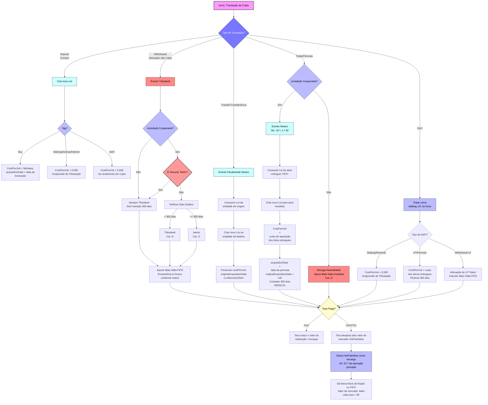

# Documento técnico: Um algoritmo aberto para a fiscalidade de criptoativos em Portugal

---

### ⚠️ Aviso legal e limitações (leitura obrigatória)

Este algoritmo é uma ferramenta de cálculo baseada numa interpretação lógica do CIRS e nas orientações dos informativos fiscais vigentes. No entanto, existem nuances legais críticas que exigem intervenção manual do utilizador:

1. ***Security tokens* (valores mobiliários):** O algoritmo assume por defeito que os ativos **NÃO** são valores mobiliários. Se o criptoativo representar uma participação financeira, dívida ou direito a dividendos (ex: *tokens* de *equity*, *bonds* tokenizados), a **isenção de 365 dias NÃO se aplica**. Estes ativos são sempre tributados (Categoria G), independentemente do tempo de detenção. O utilizador deve assinalar manualmente estes ativos como `isSecurityToken: true`.
   
2. ***Staking* e rendimentos em cripto:** De acordo com o entendimento do regime fiscal português, os rendimentos gerados e pagos diretamente em criptoativos (como recompensas de *staking*, *lending*, *airdrops* ou *yield farming*) beneficiam de um regime de **suspensão de tributação**.
    * **Quando se aplica?** Aplica-se no exato momento em que recebe os *tokens* na carteira. Como recebeu ativos digitais e não moeda fiduciária (Euros), a AT "congela" a exigência do imposto. Não há qualquer tributação imediata ou obrigação de declarar.
    * **Como o algoritmo trata isto?** Para refletir esta suspensão, o algoritmo regista estas entradas com um **`custo de aquisição = 0,00€`** (custo zero), iniciando aí a contagem do prazo de detenção de 365 dias.
    * **Quando termina a suspensão?** A suspensão cessa no momento em que realiza uma **alienação onerosa para moeda fiat** (venda por Euros, Dólares, etc.) ou compra bens/serviços com esses *tokens*. Nesse instante, gera liquidez real e o imposto é devido na **Categoria G (mais-valias)** sobre 100% do valor da venda (já que o custo guardado foi zero), a menos que o ativo tenha sido detido por 365 dias ou mais, caso em que fica legalmente excluído de tributação.
  
3. **Exclusão de NFT do Regime de Criptoativos (Mas sujeito a regras gerais):** Conforme o CIRS, os NFT (ativos não fungíveis) estão expressamente excluídos da definição jurídica e do regime fiscal específico dos *criptoativos*. 
    * **O que o algoritmo faz:** O algoritmo ignora o cálculo de mais-valias sobre NFT *dentro do motor de cripto*, o que significa que eles **NÃO** beneficiam da isenção de 365 dias nem da neutralidade fiscal em permutas.
    * **Impacto Fiscal Real:** A alienação onerosa de NFT pode ser tributável noutras sedes do CIRS. Se transacionados de forma esporádica por particulares, podem enquadrar-se nas regras gerais de mais-valias de bens móveis ou propriedade intelectual; se transacionados de forma recorrente, configuram rendimento comercial (Categoria B). O utilizador deve isolar estas operações para análise jurídica humana autónoma.
  
4. **Matriz de anexos da declaração de IRS:** O cálculo da mais-valia baseia-se na regra *FIFO*, e o destino de exportação do relatório segue estritamente a estrutura e instruções dos formulários oficiais da Autoridade Tributária, cruzando a natureza do ativo, o prazo de detenção e a jurisdição da entidade:
    * **Curto prazo (< 365 dias) - Tributáveis (taxa autónoma de 28%):**
        * Se a operação ocorreu através de uma corretora sediada em Portugal (`type: 'Exchange'` e `countryCode: 'PT'`): Deve ser declarada no **Anexo G, Quadro 18A**.
        * Se a operação ocorreu no estrangeiro ou em carteiras privadas (`type: 'Exchange'` com `countryCode` diferente de 'PT', ou carteiras onde `type` seja 'Cold Wallet' ou 'Hot Wallet'): Deve ser declarada detalhadamente no **Anexo J, Quadro 9.4A**.
    * **Longo prazo (>= 365 dias) - Não sujeitas a tributação:**
        * Desde que operados em jurisdições cooperantes, os ganhos com criptoativos comuns detidos por mais de um ano estão excluídos de tributação. Devem ser declarados na totalidade no **Anexo G1, Quadro 7** (mais-valias não sujeitas a tributação).

5. **Exclusão de atividade profissional (Categoria B / IRC):** Este algoritmo abrange **única e exclusivamente a gestão de património privado (Categoria G - mais-valias de particulares)**. Se o utilizador exercer uma atividade comercial ou profissional de compra e venda de criptoativos, mineração em escala industrial, ou se as transações forem efetuadas em nome de uma pessoa coletiva (empresa), os rendimentos enquadram-se na **Categoria B (regime simplificado ou contabilidade organizada)** ou em sede de **IRC**. Nestes cenários, aplicam-se regras de determinação de lucro e taxas de tributação totalmente distintas, estando fora do âmbito deste algoritmo.

---

### Índice

- [Documento técnico: Um algoritmo aberto para a fiscalidade de criptoativos em Portugal](#documento-técnico-um-algoritmo-aberto-para-a-fiscalidade-de-criptoativos-em-portugal)
    - [⚠️ Aviso legal e limitações (leitura obrigatória)](#️-aviso-legal-e-limitações-leitura-obrigatória)
    - [Índice](#índice)
  - [1. Objetivo do projeto](#1-objetivo-do-projeto)
  - [2. Arquitetura do algoritmo (v1.5.4)](#2-arquitetura-do-algoritmo-v154)
    - [2.1. Visão geral e conformidade legal](#21-visão-geral-e-conformidade-legal)
    - [2.2. Estrutura e modelo de dados](#22-estrutura-e-modelo-de-dados)
      - [Definição de entidade (`Wallet`)](#definição-de-entidade-wallet)
      - [Estrutura do lote (`Lot`)](#estrutura-do-lote-lot)
      - [Estruturas avançadas de suporte (implementação de código)](#estruturas-avançadas-de-suporte-implementação-de-código)
  - [3. Tratamento por tipo de transação](#3-tratamento-por-tipo-de-transação)
    - [3.1. `deposit`](#31-deposit)
      - [➤ Caso 1: compra com FIAT (`tag: 'buy'`)](#-caso-1-compra-com-fiat-tag-buy)
      - [➤ Caso 2: rendimento passivo (`tag: 'staking'`)](#-caso-2-rendimento-passivo-tag-staking)
    - [3.2. `withdrawal`](#32-withdrawal)
      - [Caso seja **alienação para algo não-cripto** (`fiatValue > 0`):](#caso-seja-alienação-para-algo-não-cripto-fiatvalue--0)
      - [Caso seja **transferência** (`tag = 'transfer'` e `fiatValue` = `null`):](#caso-seja-transferência-tag--transfer-e-fiatvalue--null)
      - [➤ Caso 1: venda para FIAT (`fiatValue > 0`, `tag: 'sell'`) em jurisdição cooperante](#-caso-1-venda-para-fiat-fiatvalue--0-tag-sell-em-jurisdição-cooperante)
      - [➤ Caso 2: venda para FIAT numa jurisdição não cooperante (paraíso fiscal)](#-caso-2-venda-para-fiat-numa-jurisdição-não-cooperante-paraíso-fiscal)
      - [➤ Caso 3: venda para FIAT com taxa em cripto](#-caso-3-venda-para-fiat-com-taxa-em-cripto)
      - [➤ Caso 4: transferência entre entidades com taxa (`tag: 'transfer'`, `fiatValue = null`)](#-caso-4-transferência-entre-entidades-com-taxa-tag-transfer-fiatvalue--null)
  - [➡️ **O montante principal (0.499 BTC) é neutro fiscalmente**, servindo a baixa da comissão apenas para manter o inventário físico da pilha FIFO sincronizado.](#️-o-montante-principal-0499-btc-é-neutro-fiscalmente-servindo-a-baixa-da-comissão-apenas-para-manter-o-inventário-físico-da-pilha-fifo-sincronizado)
    - [3.3. `trade` (permuta cripto-cripto)](#33-trade-permuta-cripto-cripto)
      - [➤ Caso 1: permuta simples em entidade cooperante (BTC → ETH)](#-caso-1-permuta-simples-em-entidade-cooperante-btc--eth)
      - [➤ Caso 2: permuta simples em entidade não cooperante (BTC → ETH)](#-caso-2-permuta-simples-em-entidade-não-cooperante-btc--eth)
      - [➤ Caso 3: permuta com múltiplos ativos (BTC → ETH + SOL)](#-caso-3-permuta-com-múltiplos-ativos-btc--eth--sol)
  - [4. Tratamento das taxas](#4-tratamento-das-taxas)
    - [4.1. Taxa paga em FIAT](#41-taxa-paga-em-fiat)
    - [4.2. Taxa paga em cripto](#42-taxa-paga-em-cripto)
      - [➤ Caso 1: taxa paga em FIAT](#-caso-1-taxa-paga-em-fiat)
      - [➤ Caso 2: taxa paga em cripto](#-caso-2-taxa-paga-em-cripto)
  - [5. Tratamento fiscal de NFT](#5-tratamento-fiscal-de-nft)
    - [5.1 O que é NFT?](#51-o-que-é-nft)
    - [5.2. Enquadramento fiscal de NFT em Portugal (CIRS)](#52-enquadramento-fiscal-de-nft-em-portugal-cirs)
    - [5.3 Como o algoritmo trata os NFT](#53-como-o-algoritmo-trata-os-nft)
  - [6. Tratamento fiscal de _DeFi_](#6-tratamento-fiscal-de-defi)
    - [6.1. O que é _DeFi_?](#61-o-que-é-defi)
    - [Exemplos comuns de _DeFi_:](#exemplos-comuns-de-defi)
    - [6.2. Enquadramento fiscal de _DeFi_ em Portugal (CIRS)](#62-enquadramento-fiscal-de-defi-em-portugal-cirs)
    - [6.3 Princípios aplicáveis ao _DeFi_:](#63-princípios-aplicáveis-ao-defi)
    - [6.4. Como implementar _DeFi_ no algoritmo](#64-como-implementar-defi-no-algoritmo)
      - [➤ Caso 1: *staking* / *yield farming* / recompensas](#-caso-1-staking--yield-farming--recompensas)
      - [➤ Caso 2: fornecimento de liquidez (*liquidity pool*)](#-caso-2-fornecimento-de-liquidez-liquidity-pool)
      - [➤ Caso 3: retirada de liquidez (*withdrawal* de *LP*)](#-caso-3-retirada-de-liquidez-withdrawal-de-lp)
      - [➤ Caso 4: taxas em _DeFi_ (*gas fees*)](#-caso-4-taxas-em-defi-gas-fees)
  - [7. Sumário final](#7-sumário-final)
  - [8. Matriz de exportação de relatórios (IRS)](#8-matriz-de-exportação-de-relatórios-irs)
  - [9. Fluxograma das transações](#9-fluxograma-das-transações)
  - [🤝 Como Contribuir](#-como-contribuir)
  - [📄 Licença](#-licença)

---

## 1. Objetivo do projeto

Este repositório contém uma especificação técnica aberta e um algoritmo para o cálculo fiscal de mais-valias de criptoativos em Portugal, de acordo com o CIRS.

O objetivo é criar e manter uma "fonte da verdade" lógica e transparente que possa ser:
* **Validada** por especialistas em fiscalidade e contabilidade.
* **Discutida e melhorada** pela comunidade.
* **Implementada** por qualquer desenvolvedor ou aplicação que precise de calcular mais-valias de criptoativos em Portugal.

**Este é um projeto de lógica e especificação, não de código.** A sua contribuição, seja através de uma *issue* para apontar uma falha na interpretação da lei ou de um *pull request* para melhorar este documento, é extremamente bem-vinda.

---

## 2. Arquitetura do algoritmo (v1.5.4)

### 2.1. Visão geral e conformidade legal

Este documento descreve um algoritmo fiscal, desenhado para estar em conformidade com o CIRS português, nomeadamente os Artigos **10.º** e **43.º**. A abordagem segue uma interpretação **conservadora, rigorosa e lógica** da lei.

O motor opera sobre os seguintes princípios fundamentais:

1. **FIFO por entidade depositária (Art. 43.º, n.º 9):** O método `FIFO (First-In, First-Out)` é aplicado individualmente a cada "entidade depositária" (ex.: *exchanges*). Todas as carteiras *self-custody* (frias, quentes, etc.) são tratadas como uma única entidade depositária para efeitos de cálculo, a menos que o utilizador opte por separá-las.

2. **Transferência entre entidades é um evento neutro:** Transferir ativos entre entidades do mesmo titular é uma mera mudança de local de custódia. **Não é um evento tributável**. O lote transferido mantém **custo e data de aquisição originais**.

3. **Elegibilidade territorial e cláusula anti-abuso (Art. 10.º, n.º 21):** Os benefícios de neutralidade fiscal nas permutas e a isenção de mais-valias após 365 dias aplicam-se apenas se a entidade onde se realiza a operação ou a contraparte estiver sediada num país cooperante (Estados-Membros da UE, EEE ou países com convenção de dupla tributação ou acordo de troca de informações com Portugal). Se a jurisdição for considerada não cooperante (paraíso fiscal), todos os benefícios fiscais deixam de se aplicar.

4. **Neutralidade fiscal condicionada para permutas cripto-cripto (Art. 10.º, n.º 20):** Numa permuta cripto-cripto (ex.: BTC → ETH) realizada numa entidade de jurisdição cooperante, a operação é uma alienação onerosa mas **não gera tributação** no momento da troca. O novo ativo é considerado uma **nova aquisição**, com **valor de aquisição igual ao valor de aquisição do ativo entregue**, e nova data da permuta. Este valor e nova data servirão como base para o cálculo de futuras mais-valias. A contagem dos 365 dias reinicia para o novo ativo recebido. Se ocorrer numa entidade não cooperante, a neutralidade fiscal é revogada e a mais-valia é apurada em euros imediatamente.

5. **Rendimentos em cripto (*staking*/*airdrop*/*rewards*/*interest*):** São tratados sob o regime de **suspensão de tributação**. O custo de aquisição é **Zero**.
   * **Fiscalidade:** Não são tributados no momento da receção. A tributação ocorre apenas no momento da alienação onerosa (venda para Euros), sendo enquadrada na Categoria G (mais-valias).
   * **Custo para mais-valias:** O `cost basis` é **0,00€**, garantindo que o valor total da venda futura seja tributável ou isento de acordo com a regra dos 365 dias.

6. **Distinção security tokens vs. criptoativos comuns:**
   * **Criptoativos comuns (valores não mobiliários ex: BTC, ETH):** Isentos de imposto se detidos por >= 365 dias em jurisdições cooperantes.
   * **Security tokens (valores mobiliários):** **Nunca isentos**. Sempre tributados à taxa de 28% (ou englobamento), independentemente do tempo de detenção.

---

### 2.2. Estrutura e modelo de dados

O sistema utiliza uma estrutura de pilhas FIFO por entidade: um `Map<Entity, Map<Asset, List<Lot>>>`.

#### Definição de entidade [(`Wallet`)](docs/modelo_wallet.md)
Cada entidade (carteira ou *exchange*) deve ser criada com os seguintes atributos:
* **`name`**: Nome dado pelo utilizador à carteira (ex: "Kraken", "Ledger Nano X").
* **`type`**: O tipo de carteira. Ex: '*Exchange*', '*Cold Wallet*', '*Hot Wallet*', '*Other*'.
* **`creationDate`**: Data em que a carteira foi criada.
* **`countryCode`**: Código ISO-3166 alfa-2 do país onde a entidade está sediada (ex: 'PT', 'IE', 'KY').

O algoritmo calcula os seguintes estados implícitos no momento da transação:
* **`fiscalEligibility`**: Determinado a partir do `countryCode`. Consulta uma tabela interna para classificar o país como cooperante (`COOPERATING`), não cooperante (`NON_COOPERATING` - paraísos fiscais da lista negra nacional) ou desconhecido. O estado desconhecido suspende o cálculo para obrigar à revisão e intervenção manual.
* **Destino declarativo**: Determinado de forma dinâmica no processamento. Se `type` for 'Exchange' e `countryCode` for 'PT', as mais-valias de curto prazo seguem para o **Anexo G**. Se `type` for 'Exchange' e `countryCode` for diferente de 'PT' (ex: 'IE'), seguem para o **Anexo J**. Para carteiras pessoais ou DeFi (`type` igual a 'Cold Wallet' ou 'Hot Wallet'), o algoritmo assume por defeito o `countryCode` de residência do sujeito passivo (ex: 'PT') para efeitos de `fiscalEligibility`, mas encaminha sempre o curto prazo para o **Anexo J**, uma vez que a custódia não pertence a um intermediário financeiro nacional.

#### Estrutura do lote (`Lot`)
Este modelo representa cada fração de criptoativo armazenada na base de dados local, funcionando como uma pilha cronológica para o método FIFO. Cada lote retém a quantidade disponível, o custo unitário histórico de aquisição e a data original em que o ativo entrou no património do utilizador.

Cada `Lot` deve ter:

* **`acquisitionDate`**: Data da operação atual (causada por depósito, permuta ou transferência).
* **`costPerUnit`**: Custo unitário em EUR.
* **`amount`**: Quantidade do ativo.
* **`originalAcquisitionDate`** (opcional): Data da compra original (crucial para a regra dos 365 dias).
* **`isSecurityToken`** (boolean): Define se o ativo está sujeito a tributação obrigatória (sem isenção de 365 dias).

> [!NOTE]
> O campo `originalAcquisitionDate` preserva a data de compra original quando um ativo é transferido entre entidades, impedindo o reinício incorreto do contador dos 365 dias.

#### Estruturas avançadas de suporte (implementação de código)

<b>Clique para expandir os esquemas e ficheiros de suporte técnico</b>

Para evitar o crescimento excessivo deste documento com propriedades estritas de engenharia de software, os esquemas de propriedades detalhados dos restantes modelos e payloads foram movidos para a documentação técnica de suporte:

[Especificação completa de (`Wallet`)](docs/modelo_wallet.md) 
[Especificação completa de (`Transaction`)](docs/modelo_transaction.md) - Contém todos os campos de importação de dados e o funcionamento além de `feeFiatValue`.

---

## 3. Tratamento por tipo de transação

### 3.1. `deposit`

Um depósito é sempre uma **aquisição** que cria um novo lote:
* **tag: 'buy':** `costPerUnit` = `fiatValue`, `acquisitionDate` = data da transação.
* **tag: 'staking', 'airdrop', 'interest', 'rewards', 'defi':**
    * `costPerUnit` = **0,00€** (suspensão de tributação).
    * `acquisitionDate` = data da transação (início da contagem dos 365 dias).
* **`originalAcquisitionDate`** = `null`.

#### ➤ Caso 1: compra com FIAT (`tag: 'buy'`)
**Exemplo:**
- Data: 2023-01-15
- Entidade: Kraken (countryCode: 'IE')
- Ativo: BTC
- Quantidade: 1.0
- Valor em FIAT: 30.000€

**Resultado:**
- Cria novo lote:
  - `acquisitionDate = 2023-01-15`
  - `costPerUnit = 30.000€`
  - `amount = 1.0`
  - `originalAcquisitionDate = null`
  - `isSecurityToken = false`

#### ➤ Caso 2: rendimento passivo (`tag: 'staking'`)
**Exemplo:**
- Data: 2024-03-10
- Entidade: Ledger (type: 'Cold Wallet')
- Ativo: ETH
- Quantidade: 0.05 

**Cálculo interno do algoritmo:**
- Custo de aquisição = **0,00€**

**Resultado:**
- Cria novo lote:
  - `acquisitionDate = 2024-03-10`
  - `costPerUnit = 0,00€`
  - `amount = 0.05`
  - `originalAcquisitionDate = null`
- *Ação fiscal:* Nenhuma declaração imediata no momento da receção. A tributação ocorrerá apenas na venda deste lote por Euros ou outra moeda fiduciária. Se detido por mais de 365 dias em ambiente cooperante, a venda total estará isenta.

---

### 3.2. `withdrawal`

Inclui **qualquer alienação para algo não-cripto**, como:
* **FIAT**
* **NFT**
* **Compra de bens ou serviços**
* **Pagamentos com cartões que gastem a sua cripto**

#### Caso seja **alienação para algo não-cripto** (`fiatValue > 0`):

➡️ **Evento tributável.**

Antes de calcular o prazo de detenção, o algoritmo valida o `fiscalEligibility` da entidade de origem. Aciona o `_calculateFifoForSale` na entidade correspondente.

Para cada lote consumido: **`data de aquisição efetiva = originalAcquisitionDate ?? acquisitionDate`**

**Regra de tributação:**
1. Se `isSecurityToken == true`: **Sempre tributável** (28% ou englobamento).
2. Se `isSecurityToken == false`:
    * Se `fiscalEligibility == NON_COOPERATING`: **Sempre tributável** (28% ou englobamento) por força do Artigo 10.º, n.º 21 do CIRS, revogando o benefício da isenção por prazo.
    * Se `fiscalEligibility == COOPERATING`:
        * Dias detidos < 365: **Tributável** (28% ou englobamento).
        * Dias detidos >= 365: **Isento**.

#### Caso seja **transferência** (`tag = 'transfer'` e `fiatValue` = `null`):

➡️ **Evento neutro.**

 1. Consome lotes da entidade de origem.  
 2. Cria lotes na entidade de destino.  
 3. Preserva os seguintes dados inalterados:
    * `costPerUnit`
    * `originalAcquisitionDate` (caso seja nulo, herda a `acquisitionDate` do lote consumido).
    * `isSecurityToken`

A data da transferência em si (`acquisitionDate` do novo local) **não influencia os 365 dias**.

#### ➤ Caso 1: venda para FIAT (`fiatValue > 0`, `tag: 'sell'`) em jurisdição cooperante
**Exemplo:**
- Data: 2024-10-01
- Entidade: Kraken (countryCode: 'IE')
- Ativo: BTC
- Quantidade: 0.5
- Valor em FIAT: 30.000€
- Custo do lote consumido (FIFO): 0.5 × 30.000€ = 15.000€
- Data de aquisição efetiva: 2023-01-15
- Dias detidos: 624 dias → **Isento** (por ser cooperante, detido por >= 365 dias e não-security)

**Cálculo:**
- Mais-valia = 30.000€ - 15.000€ = **15.000€**
- Tributação: **Isento** (Encaminhado para o **Anexo G1, Quadro 7**).

#### ➤ Caso 2: venda para FIAT numa jurisdição não cooperante (paraíso fiscal)
**Exemplo:**
- Data: 2024-10-01
- Entidade: CaymanExchange (countryCode: 'KY', fiscalEligibility: NON_COOPERATING)
- Ativo: BTC
- Quantidade: 0.5
- Valor em FIAT: 30.000€
- Custo do lote consumido (FIFO): 15.000€
- Data de aquisição efetiva: 2023-01-15
- Dias detidos: 624 dias

**Cálculo:**
- Mais-valia = 30.000€ - 15.000€ = **15.000€**
- Tributação: **Tributável** à taxa autónoma de 28% no **Anexo J, Quadro 9.4A**. A isenção dos 365 dias é revogada por força do Art. 10.º, n.º 21.

#### ➤ Caso 3: venda para FIAT com taxa em cripto
**Exemplo:**
- Data: 2024-10-01
- Entidade: Kraken (countryCode: 'IE')
- Ativo: BTC
- Quantidade: 0.5
- Valor em FIAT (Bruto): 30.000€ (Custo de aquisição FIFO: 15.000€)
- Custo de aquisição do lote principal (0.5 BTC): 15.000 € (detido há 180 dias)
- Taxa: 0.001 BTC  (valor explicito de mercado: 60€)
- **Valorização de mercado:** `feeFiatValue` = 60€ (calculado offline/online com base na cotação no momento da transação).
- Dias detidos do lote principal: 180 dias → **Tributável**

[//]: # (Issue #4 & #5)
**Cálculo:**
1. **Tratamento do encargo (Art. 51.º, n.º 1, al. b) CIRS):** O montante da despesa dedutível é fixado estritamente pelo valor de mercado no momento da transação (`feeFiatValue` = 60€). Este valor abate diretamente ao valor de realização bruto da operação principal.
   - Valor de Realização Líquido = 30.000€ - 60€ = 29.940€
   - Mais-valia Líquida da Operação = 29.940€ - 15.000€ = **14.940€**

2. **Ajuste de inventário da taxa (Art. 10.º):** A fração gasta (0.001 BTC) dá baixa do inventário local pelo seu valor de mercado no momento (60€). Sendo valorizada ao preço do momento da transação, a mais-valia intrínseca da taxa é **0,00€**, servindo a operação apenas para o ajuste físico de inventário na pilha FIFO.

**Resultado da Operação Principal:**
- Total mais-valia combinada tributável: **14.940€** (A despesa de 60€ reduziu o lucro de forma uniforme e coerente, eliminando a anomalia anterior de 15.030€).
- Encaminhamento: Reportado no **Anexo J, Quadro 9.4A**.

#### ➤ Caso 4: transferência entre entidades com taxa (`tag: 'transfer'`, `fiatValue = null`)
**Exemplo:**
- Data: 2024-06-01
- Entidade de origem: Kraken (countryCode: 'IE')
- Entidade de destino: Ledger (type: 'Cold Wallet')
- Ativo: BTC
- Quantidade enviada: 0.5
- Taxa de rede cobrada: 0.001 BTC (valor de mercado implícito: 60€)
- Custo do lote de taxa consumido (FIFO): 30€
- Data de aquisição original do lote: 2024-01-15 (< 365 dias)

**Resultado:**

[//]: # (TODO: Clarificar a explicação)
- **Ajuste de inventário da taxa (Art. 10.º):** a comissão de rede (0.001 BTC) dá baixa física no inventário local pelo seu valor de mercado no momento (`feeFiatValue` = 60 €). Sendo valorizada estritamente pelo custo do serviço no instante da operação, a mais-valia comercial intrínseca da comissão é 0.00 €, eliminando obrigações declarativas autónomas ou impostos sobre a taxa.
- **Criação do novo lote na Ledger:**
  - `acquisitionDate = 2024-06-01`
  - `costPerUnit = 30.000€`
  - `amount = 0.499` (0.500 enviado - 0.001 de taxa)
  - `originalAcquisitionDate = 2024-01-15`
  - `isSecurityToken` = (preservado da origem)

➡️ **O montante principal (0.499 BTC) é neutro fiscalmente**, servindo a baixa da comissão apenas para manter o inventário físico da pilha FIFO sincronizado.
---

### 3.3. `trade` (permuta cripto-cripto)

O fluxo lógico depende diretamente da elegibilidade da entidade detentora:

* **Se `fiscalEligibility == COOPERATING`:** ➡️ **Evento neutro - Art. 10.º, n.º 20**
   1. Consome lotes do ativo entregue através da pilha FIFO.
   2. Cria um novo lote para o ativo recebido.
   3. O custo do novo lote herda o custo histórico: `costPerUnit` = custo total de aquisição dos lotes entregues dividido pelo novo `amount`.
   4. `acquisitionDate` = data da permuta atual.
   5. `originalAcquisitionDate` = `null` (**O contador de 365 dias reinicia** para zero no novo ativo).
   6. `isSecurityToken` = (mapeado de acordo com a natureza do novo ativo recebido).
* **Se `fiscalEligibility == NON_COOPERATING`:** ➡️ **Evento tributável - Art. 10.º, n.º 21**
   A neutralidade fiscal é completamente revogada. Ocorre o apuramento de mais-valias imediato em euros, calculando a diferença entre o valor de mercado atual do ativo entregue e o seu custo de aquisição. O ativo recebido entra na pilha com uma nova `acquisitionDate` e o seu `costPerUnit` atualizado ao preço de mercado.

#### ➤ Caso 1: permuta simples em entidade cooperante (BTC → ETH)
**Exemplo:**
- Data: 2024-07-01
- Entidade: Kraken (countryCode: 'IE', COOPERATING)
- Ativo entregue: BTC (0.5) - Custo histórico FIFO: 15.000€
- Ativo recebido: ETH (0.3)

**Resultado:**
- Cria novo lote de ETH na Kraken:
  - `acquisitionDate = 2024-07-01`
  - `costPerUnit = 15.000€ / 0.3 = 50.000€/ETH`
  - `amount = 0.3`
  - `originalAcquisitionDate = null` (o relógio de 365 dias faz reset)
  - `isSecurityToken = false`

➡️ **Evento  neutro fiscalmente**, não gerando qualquer registo ou obrigação declarativa imediata.

#### ➤ Caso 2: permuta simples em entidade não cooperante (BTC → ETH)
**Exemplo:**
- Data: 2024-07-01
- Entidade: CaymanExchange (countryCode: 'KY', NON_COOPERATING)
- Ativo entregue: BTC (0.5) - Custo histórico FIFO: 15.000€
- Ativo recebido: ETH (0.3)
- Valor de mercado em Euros do BTC entregue no momento da troca: 25.000€

**Resultado:**
- Revogação de neutralidade: Apuramento imediato de mais-valia comercial.
  - Mais-valia = 25.000€ (valor de mercado de realização) - 15.000€ (custo) = **10.000€**
- Ação: **Tributável** à taxa de 28% no **Anexo J, Quadro 9.4A**.
- Cria novo lote de ETH na CaymanExchange:
  - `acquisitionDate = 2024-07-01`
  - `costPerUnit = 25.000€ / 0.3 = 83.333,33€/ETH`
  - `amount = 0.3`
  - `originalAcquisitionDate = null`

#### ➤ Caso 3: permuta com múltiplos ativos (BTC → ETH + SOL)

**Exemplo:**
- Data: 2024-08-15
- Entidade: Binance (type: 'Exchange', countryCode: 'GE')
- Ativo entregue: BTC (1.0) - Custo histórico total: 30.000€
- Ativos recebidos: ETH (0.3) + SOL (0.2)
- Valores de mercado proporcionais calculados no instante da troca:
  - Fração ETH: Representa 75% do valor total da transação.
  - Fração SOL: Representa 25% do valor total da transação.

**Cálculo do custo proporcional distribuído:**
- Custo total do BTC entregue a fracionar: 30.000€
- Custo atribuído ao ETH = 75% × 30.000€ = **22.500€**
- Custo atribuído ao SOL = 25% × 30.000€ = **7.500€**

**Resultado:**
- Lote de ETH:
  - `acquisitionDate = 2024-08-15`
  - `costPerUnit = 22.500€ / 0.3 = 75.000€/ETH`
  - `amount = 0.3`
  - `originalAcquisitionDate = null`
- Lote de SOL:
  - `acquisitionDate = 2024-08-15`
  - `costPerUnit = 7.500€ / 0.2 = 37.500€/SOL`
  - `amount = 0.2`
  - `originalAcquisitionDate = null`

➡️ **Evento neutro fiscalmente**, não gera tributação imediata.

---

## 4. Tratamento das taxas

A lógica de tratamento de taxas é offline e determinística, aplicando os princípios gerais de "alienação onerosa" (Art. 10.º) e "apuramento de mais-valias" (Art. 43.º).

### 4.1. Taxa paga em FIAT
➡️ **É um encargo puro da alienação**, deduzido diretamente na fórmula da mais-valia.

### 4.2. Taxa paga em cripto

Ao processar uma comissão em criptoativos, o algoritmo rejeita o custo histórico (FIFO) para mensurar a despesa ou para apurar mais-valias sobre a taxa. O encargo dedutível (Art. 51.º, n.º 1, al. b) do CIRS) é determinado pelo valor de mercado em euros no momento da transação, registado no campo `feeFiatValue`.

Este tratamento é aplicado de forma uniforme em vendas, permutas e transferências, garantindo que o encargo atue como redutor do lucro tributável sem dependência de introdução manual quando exista cotação offline ou online.

#### ➤ Caso 1: taxa paga em FIAT
**Exemplo:**
- Venda de 0.5 BTC por 30.000€
- Custo FIFO do principal: 15.000€
- Taxa em FIAT: 50€

**Resultado:**
- Mais-valia = 30.000€ - 15.000€ - 50€ = **14.950€**
- Se tributável (< 365 dias): IRS = 14.950€ × 28% = **4.186€**

#### ➤ Caso 2: taxa paga em cripto
[//]: # (Issue #4 & #5)
Ao pagar uma comissão em criptoativos, o algoritmo rejeita o custo histórico (FIFO) para mensurar a despesa ou para apurar mais-valias sobre a taxa. O encargo dedutível (Art. 51.º) é fixado estritamente pelo valor de mercado em Euros no momento da transação (`feeFiatValue`).

**Exemplo:**
- Venda de 0.5 BTC por 30.000€
- Custo FIFO do principal: 15.000€
- Taxa gasta: 0.001 BTC
- Valorização de mercado no momento da operação (`feeFiatValue`): 60 €

**Resultado:**
- Mais-valia da operação principal (líquida de encargos) = 30.000€ - 60€ - 15.000€ = **14.940€**
- Mais-valia autónoma da micro-alienação da taxa = **0.00€** (a fração de 0.001 BTC dá baixa do inventário cotada ao preço de mercado do momento, anulando ganhos fictícios).
- Total mais-valia combinada = **14.940€**

O encargo cumpre o papel fiscal de mitigar o lucro tributável global da operação, garantindo o tratamento idêntico às taxas pagas em moeda fiduciária e corrigindo a anomalia onde o imposto subia para 15.030 €.

> [!NOTE]
> **Taxas em transferências:** Mesmo que a transferência entre entidades do mesmo titular seja neutra fiscalmente, a taxa de rede paga em cripto é processada como uma baixa de inventário pelo valor de mercado do momento (mais-valia zero), garantindo a exatidão física dos lotes e saldos das carteiras sem gerar imposto.
---

## 5. Tratamento fiscal de NFT

### 5.1 O que é NFT?
NFT significa *Non-Fungible Token* (*Token* não fungível). Representa um certificado digital de propriedade sobre um ativo único, indivisível e não intermutável (ex.: arte digital, colecionáveis, registos de exclusividade).

**Não fungível** = único e irrepetível.
Diferente de moedas ou criptomoedas (como Bitcoin ou Ethereum), que são fungíveis. Um NFT é único - não pode ser trocado por outro igual.

**Exemplo:**
- Um Bitcoin = outro Bitcoin → fungível.
- Um NFT de uma obra de arte digital = só existe um → não fungível.

### 5.2. Enquadramento fiscal de NFT em Portugal (CIRS)
Por força da exclusão legal da definição de criptoativos, as transações de NFT **não seguem o regime das criptomoedas**. Isto implica um tratamento severo pelo algoritmo:

1. **Revogação de Isenções:** Não existe exclusão de tributação após 365 dias de detenção.
2. **Permutas Tributáveis:** Trocar um NFT por outro (ou por ETH) não goza de neutralidade fiscal. É um evento de alienação imediato com apuramento de ganho em Euros baseado no valor de mercado.

### 5.3 Como o algoritmo trata os NFT
Para evitar cálculos errados e proteger o utilizador, o algoritmo implementa uma **"Flag de Bloqueio/Alerta"** (`assetType: 'NFT'`).

Em vez de aplicar a lógica FIFO de cripto, o motor suspende o processamento da linha e emite um aviso ao utilizador para reporte manual na categoria geral correspondente do IRS (ex: Categoria B se houver cariz profissional, ou mais-valia geral se aplicável), uma vez que a Autoridade Tributária analisa estes ativos pela sua substância (ex: se representa arte digital, propriedade, ou um direito de serviço).

---

## 6. Tratamento fiscal de _DeFi_

### 6.1. O que é _DeFi_?
*DeFi* (*Decentralized Finance*) engloba serviços financeiros (empréstimos, trocas automatizadas, derivados) executados diretamente através de *smart contracts* em redes *blockchain*, sem a presença de intermediários centralizados.
 
### Exemplos comuns de _DeFi_:
- ***Staking* (delegar *tokens* para validar redes)**
- ***Lending* & *Borrowing* (emprestar ou pedir emprestado cripto)**
- ***Liquidity pools* (fornecer liquidez em _exchanges_ descentralizadas como Uniswap)**
- ***Yield farming* (ganhar recompensas por fornecer liquidez)**
- ***Stablecoins* (USDC, DAI, etc.)**

### 6.2. Enquadramento fiscal de _DeFi_ em Portugal (CIRS)
O CIRS não faz qualquer distinção operacional entre finanças descentralizadas (*DeFi*) ou centralizadas (*CeFi*). As regras gerais da Categoria G aplicam-se igualmente à natureza dos ativos movimentados.

### 6.3 Princípios aplicáveis ao _DeFi_:
1. **Rendimentos passivos (*staking*, *yield farming*):** São tratados sob o regime de **suspensão de tributação**. O custo de aquisição é **0,00€**.
2. **Alienação de ativos _DeFi_ (venda, troca, saque):** Mais-valia calculada com *FIFO*.
3. **Permutas _DeFi_ (ex.: ETH → *LP token*):** Neutras fiscalmente (Art. 10.º, n.º 20).
4. **Taxas em _DeFi_ (*gas fees*):** Tratadas como micro-alienações se pagas em cripto.
5. **Isenção após 365 dias:** Aplicável apenas a criptoativos não-mobiliários.

### 6.4. Como implementar _DeFi_ no algoritmo

> [!NOTE]
> No DeFi o ónus da prova cabe inteiramente ao contribuinte. A Autoridade Tributária (AT) não monitoriza de forma automática as suas wallets privadas ou protocolos descentralizados, pelo que é o titular quem tem de demonstrar a origem, o histórico e o tempo de detenção dos ativos para beneficiar das isenções fiscais.
 
Como os protocolos *DeFi* correm em contratos sem localização geográfica tradicional, o algoritmo determina a `fiscalEligibility` avaliando o `type` da carteira que assina a transação (`Cold/Hot Wallet`), herdando o país de residência fiscal do utilizador (ex: 'PT' = `COOPERATING`). No entanto, o encaminhamento declarativo de curto prazo é sempre remetido para o **Anexo J**, dada a ausência de intermediário financeiro nacional.

#### ➤ Caso 1: *staking* / *yield farming* / recompensas
**Exemplo:**
- Data: 2024-06-15
- Entidade: Uniswap Protocol (`type: 'Hot Wallet'`)
- Ativo: USDC
- Quantidade: 100
- Tipo: `deposit`, Tag: `defi`

**Resultado:**
- Cria novo lote:
  - `acquisitionDate = 2024-06-15`
  - `costPerUnit = 0,00€`
  - `amount = 100`
  - `originalAcquisitionDate = null`
- *Ação fiscal:* Nenhuma no momento da receção. A tributação ocorrerá apenas na venda por Euros (Categoria G).

#### ➤ Caso 2: fornecimento de liquidez (*liquidity pool*)
**Exemplo:**
- Data: 2024-07-01
- Entidade: Uniswap
- Ativo entregue: ETH (0.5) + USDC (500)
- Custo histórico total dos lotes entregues: 0.5 × 3.000€ + 500€ = 2.000€
- Ativo recebido: UNI-V2 LP Token (1.0)

**Resultado:**
- Cria novo lote de *LP token*:
  - `acquisitionDate = 2024-07-01`
  - `costPerUnit = 2.000€ / 1.0 = 2.000€/LP`
  - `amount = 1.0`
  - `originalAcquisitionDate = null` (contador reinicia)

➡️ **Evento neutro fiscalmente**, permuta cripto-cripto.

#### ➤ Caso 3: retirada de liquidez (*withdrawal* de *LP*)
**Exemplo:**
- Data: 2025-01-10
- Entidade: Uniswap
- Ativo: UNI-V2 LP Token (1.0)
- Quantidade: 1.0
- Valor em FIAT (mercado): 2.500€
- Custo do LP Token: 2.000€
- Dias detidos: 193 dias (< 365 dias) → **Tributável**

**Cálculo:**
- Mais-valia = 2.500€ - 2.000€ = **500€**
- IRS = 500€ × 28% = **140€**
> [!NOTE]
> Os ativos recebidos de volta (ETH, USDC) entram como novos lotes com custo igual ao seu valor de mercado no dia da retirada (2.500€ no total).
- **Ação:** Sendo curto prazo numa estrutura sem intermediário nacional, é direcionado para o **Anexo J, Quadro 9.4A**.

#### ➤ Caso 4: taxas em _DeFi_ (*gas fees*)
**Exemplo:**
- Transação DeFi (ex.: staking)
- Taxa paga em ETH: 0.005 ETH
- Valor de mercado da taxa no momento (`feeFiatValue`): 15 €

**Resultado:**
- **Tratamento do encargo (Art. 51.º):** o montante de 15€ é assumido como a despesa suportada na operação. Se a transação _DeFi_ principal associada for um evento tributável, este valor é deduzido como encargo da alienação.
- **Ajuste de inventário:** os 0.005 ETH dão baixa da pilha FIFO local com base no valor de mercado (15€), gerando uma mais-valia interna autónoma de 0.00€.
---

## 7. Sumário final

**Depósitos:** criam novos lotes com o custo real (no caso de uma compra) ou com **custo zero** (no caso de rendimentos passivos recebidos diretamente em criptoativos).

**Alienações para FIAT, bens ou serviços:** Curto prazo (< 365 dias) é sempre tributado a 28%. Longo prazo (≥ 365 dias) em países cooperantes é isento. Transações em paraísos fiscais perdem o direito a isenção de longo prazo.
  - Se operado em jurisdição cooperante: são **tributáveis** (Categoria G) se detidos por menos de 365 dias, e estão **excluídos de tributação** se detidos por 365 dias ou mais (exceto *security tokens*).
  - Se operado em jurisdição não cooperante: Sempre tributável na Categoria G (28%).
  
**Alienações de NFT:** São tributados em Portugal, mas estão excluídos do regime especial de criptoativos.  Os ganhos obtidos com a sua venda enquadram-se nas regras gerais de mais-valias do IRS
  - Vendas ocasionais (Categoria G)
  - Atividade profissional (Categoria B)
  
***Security tokens*:** **sempre tributáveis** (Categoria G), independentemente do tempo de detenção. Não beneficiam da isenção de longo prazo.

**Transferências entre entidades:** evento totalmente neutro que apenas altera o local de custódia (*self-custody* ou *exchanges*). Preserva a data e o custo de aquisição originais para o cálculo do *FIFO*.

**Permutas (*trades*):** evento fiscalmente neutro (Art. 10.º, n.º 20) apenas se operado em entidades cooperantes - o novo ativo recebido herda o custo de aquisição proporcional do ativo entregue e **reinicia a contagem do prazo de 365 dias** para zero. Tornam-se tributáveis no momento da troca se efetuadas em entidades de paraísos fiscais.

[//]: # (Issue #4 & #5) 
**Taxas (*gas fees* / comissões):** a despesa dedutível (Art. 51.º) é medida pelo seu valor de mercado em euros no momento da operação (`feeFiatValue`), eliminando o uso de regras FIFO para apurar o montante do encargo. Atua reduzindo o valor de realização da transação principal em vendas, trocas e transferências. A fração de cripto gasta dá baixa do inventário pelo valor do momento (mais-valia comercial da taxa de 0.00 €).

---

## 8. Matriz de exportação de relatórios (IRS)

A geração de relatórios de exportação cruza a natureza do ativo, o prazo de detenção e a jurisdição da entidade para o preenchimento correto dos anexos da Autoridade Tributária:

| Natureza do ativo | Prazo de detenção | Entidade com sede em Portugal (`type: 'Exchange'`, `countryCode: 'PT'`) | Entidade estrangeira cooperante ou carteira pessoal (`type: 'Exchange'` com `countryCode` diferente de 'PT', ou carteiras 'Wallet') | Entidade não cooperante (Paraíso fiscal, `fiscalEligibility: NON_COOPERATING`) |
| :--- | :--- | :--- | :--- | :--- |
| **Criptoativo comum** | Curto Prazo (< 365 dias) | **Anexo G, Quadro 18A** (Tributável) | **Anexo J, Quadro 9.4A** (Tributável) | **Anexo J, Quadro 9.4A** (Tributável) |
| **Criptoativo comum** | Longo Prazo (≥ 365 dias) | **Anexo G1, Quadro 7** (Isento) | **Anexo G1, Quadro 7** (Isento) | **Anexo J, Quadro 9.4A** (Tributável - Isenção revogada pelo Art 10 n21) |
| ***Security Token*** | Qualquer Prazo | **Anexo G, Quadro 18A** (Tributável) | **Anexo J, Quadro 9.4A** (Tributável) | **Anexo J, Quadro 9.4A** (Tributável) |
| **NFT** | Qualquer prazo | **Excluído** (Tributavel) | **Excluído** (Tributavel) | **Excluído** (Tributavel) |

---

## 9. Fluxograma das transações

```mermaid
flowchart TD
    A[Início: Transação de Cripto] --> B{Tipo de Transação?}

    %% DEPÓSITOS
    B -->|Deposit<br>Compra| C[Cria novo Lot]
    C --> C1{Tag?}
    C1 -->|Buy| C2[CostPerUnit = fiatValue,<br> acquisitionDate = data da <br>transação]
    C1 -->|Staking/Airdrop/Interest| C3[CostPerUnit = 0,00€<br>Suspensão de Tributação]
    C1 -->|DeFi| C4[CostPerUnit = 0,00€<br>Se rendimento em cripto]

    %% RETIRADAS / VENDAS
    B -->|Withdrawal<br>Alienação não-cripto| D[Evento Tributável]
    D --> D0{Jurisdição Cooperante?}
    D0 -->|Não| D2[Sempre Tributável<br>Isenção revogada pelo Art 10 n21]
    D0 -->|Sim| D1{É Security Token?}
    D1 -->|Sim| D2[Sempre Tributável<br> Sem isenção 365 dias]
    D1 -->|Não| D3[Verificar Dias Detidos]
    D3 -->|< 365 dias| D4[Tributável<br> Cat. G]
    D3 -->|&gt= 365 dias| D5[Isento<br> Cat. G]
    D2 & D4 & D5 --> D6[Apurar Mais-Valia FIFO<br> Encaminhar p/ Anexo conforme matriz]

    %% TRANSFERÊNCIAS
    B -->|Transfer/Transferência| E[Evento Fiscalmente Neutro]
    E --> E1[Consumir Lot da<br> entidade de origem]
    E1 --> E2[Criar novo Lot na<br> entidade de destino]
    E2 --> E3[Preservar costPerUnit,<br> originalAcquisitionDate<br> e isSecurityToken]

    %% PERMUTAS / TRADES
    B -->|Trade/Permuta| F0{Jurisdição Cooperante?}
    F0 -->|Não| F_Tributavel[Revoga Neutralidade<br> Apura Mais-Valia Imediata Cat. G]
    F0 -->|Sim| F["Evento Neutro<br> 'Art. 10.º, n.º 20'"]
    F --> F1[Consumir Lot do ativo<br> entregue 'FIFO']
    F1 --> F2[Criar novo Lot para ativo<br> recebido]
    F2 --> F3[CostPerUnit <br>=<br> custo de aquisição<br> dos lotes entregues]
    F3 --> F4[acquisitionDate <br>=<br> data da permuta<br> originalAcquisitionDate = null<br> Contador 365 dias REINICIA]

    %% DEFI NOMINAL
    B -->|DeFi| G[Tratar como<br> staking, LP, ou troca]
    G --> G1{Tipo de DeFi?}
    G1 -->|Staking/Rewards| G2[CostPerUnit = 0,00€<br>Suspensão de Tributação]
    G1 -->|LP/Permuta| G3[CostPerUnit = custo<br> dos ativos entregues<br> Reinicia 365 dias]
    G1 -->|Withdrawal LP| G4[Alienação do LP Token<br> Calcular Mais-Valia FIFO]

    %% LÓGICA DE TAXAS (Encadeamento Global)
    D6 --> H{Taxa Paga?}
    E3 --> H
    F4 --> H
    F_Tributavel --> H
    G2 --> H
    G3 --> H
    G4 --> H

    H -->|FIAT| H1[Taxa reduz o valor de<br> realização / encargo]
    H -->|CRYPTO| H2[Fixa despesa pelo valor de<br> mercado: feeFiatValue]
    H2 --> H3[Deduz feeFiatValue como encargo<br> Art. 51.º da operação principal]
    H3 --> H4[Dá baixa física da fração no FIFO<br> Valor de mercado: Mais-valia taxa = 0€]

    %% ESTILIZAÇÃO DO GRAPH
    style A fill:#f9f,stroke:#333,stroke-width:2px,color:#000
    style B fill:#77f,stroke:#333,stroke-width:1px,color:#fff
    style C fill:#cff,stroke:#333,stroke-width:1px,color:#000
    style D fill:#f88,stroke:#333,stroke-width:1px,color:#000
    style E fill:#cff,stroke:#333,stroke-width:1px,color:#000
    style F fill:#cff,stroke:#333,stroke-width:1px,color:#000
    style F_Tributavel fill:#f88,stroke:#333,stroke-width:1px,color:#000
    style G fill:#bbf,stroke:#333,stroke-width:1px,color:#000
    style H fill:#fffbcc,stroke:#333,stroke-width:1px,color:#000
    style D0 fill:#bbf,stroke:#333,stroke-width:1px,color:#000
    style D1 fill:#ff9999,stroke:#333,stroke-width:2px,color:#000
    style F0 fill:#bbf,stroke:#333,stroke-width:1px,color:#000
    style C1 fill:#bbf,stroke:#333,stroke-width:1px,color:#000
    style H3 fill:#bbf,stroke:#333,stroke-width:1px,color:#000
```

[Ver fluxograma](diagrams/fluxograma.mermaid.svg)

---

## 🤝 Como Contribuir

Encontrou uma falha na nossa lógica? Acha que uma interpretação pode ser mais rigorosa?
1.  Abra uma **[Issue](https://github.com/marotoweb/declaracriptopt/issues)** para iniciar a discussão.
2.  Se tiver uma sugestão de texto, pode submeter um **Pull Request** para melhorar este documento.

---

## 📄 Licença

Este projeto é licenciado sob a [MIT License](LICENSE).  
Consulta o ficheiro para mais detalhes.

